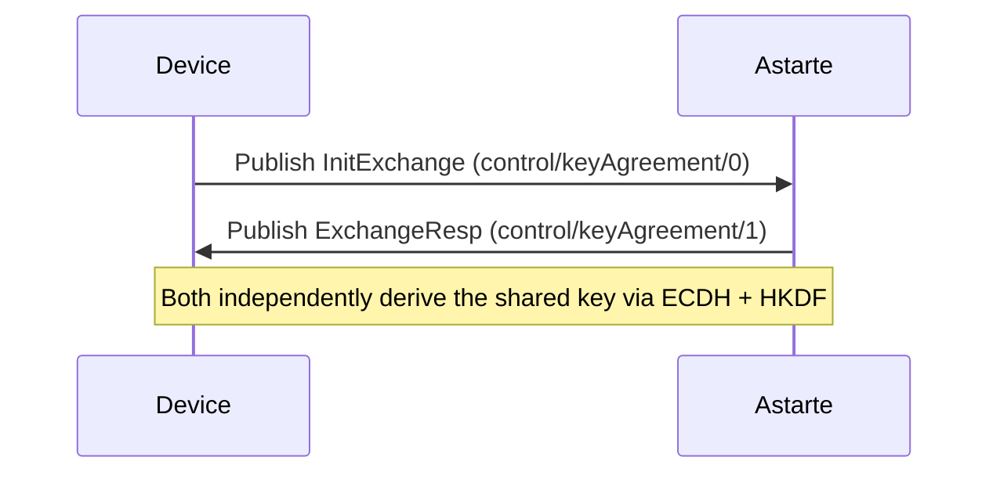
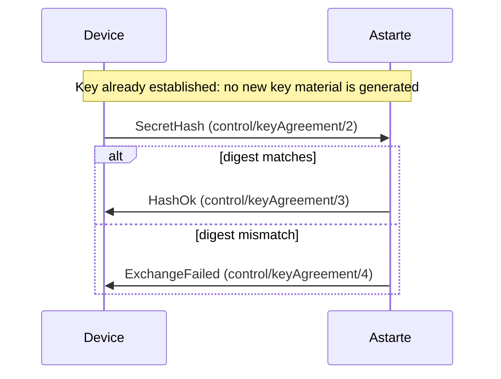
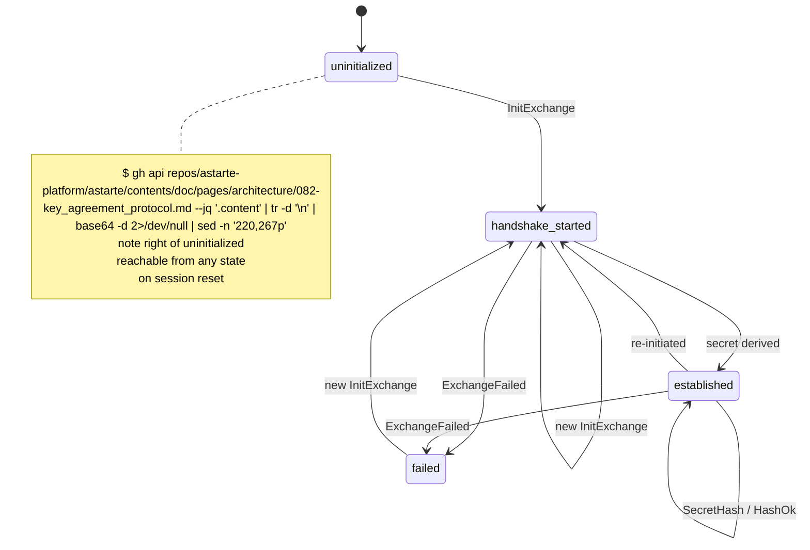

slug: recipe-astarte-upstream
verdict: proposed
at:  6217b3c
ran: 2026-09-05T18:46:25Z on DietPi in 730s


> build · big-pickle

→ Read .mule/MULE.md
→ Read .mule/recipes/astarte-upstream.md
→ Read docs/COMPATIBILITY.md

$ gh api repos/astarte-platform/astarte/releases --jq '.[0:5][] | "\(.tag_name)\t\(.published_at)"'
v1.4.0-rc.5	2026-08-20T12:28:04Z
v1.3.3	2026-08-07T14:33:58Z
v1.4.0-rc.4	2026-08-06T13:40:20Z
v1.4.0-rc.3	2026-07-31T10:48:39Z
v1.4.0-rc.2	2026-07-14T10:16:22Z

Upstream is ahead. The latest stable is `v1.3.3` and latest pre-release is `v1.4.0-rc.5`; Astrate targets `1.2.2`. Let me read the release notes.
$ gh api repos/astarte-platform/astarte/releases --jq '.[] | select(.tag_name=="v1.4.0-rc.5") | .body'
Sixth Astarte v1.4.0 release candidate.

## Changes since v1.4.0-rc.4

### Fixed

- [astarte_data_updater_plant] Make object values only validate type on selected interface
- [astarte_data_updater_plant] Ensure binaryblob data is correctly validated

$ gh api repos/astarte-platform/astarte/releases --jq '.[] | select(.tag_name=="v1.3.3") | .body'

$ gh api repos/astarte-platform/astarte/releases --jq '.[] | select(.tag_name=="v1.3.3") | .body' | wc -c
1

$ gh api repos/astarte-platform/astarte/releases --jq '.[] | select(.tag_name=="v1.4.0-rc.5") | .body'
Sixth Astarte v1.4.0 release candidate.

## Changes since v1.4.0-rc.4

### Fixed

- [astarte_data_updater_plant] Make object values only validate type on selected interface
- [astarte_data_updater_plant] Ensure binaryblob data is correctly validated

$ gh api repos/astarte-platform/astarte/releases --jq '.[0:15][] | "\(.tag_name)\t\(.published_at)\t\(.prerelease)"'
v1.4.0-rc.5	2026-08-20T12:28:04Z	true
v1.3.3	2026-08-07T14:33:58Z	false
v1.4.0-rc.4	2026-08-06T13:40:20Z	true
v1.4.0-rc.3	2026-07-31T10:48:39Z	true
v1.4.0-rc.2	2026-07-14T10:16:22Z	true
v1.4.0-rc.1	2026-07-14T08:53:27Z	true
v1.3.2	2026-07-14T10:07:26Z	false
v1.3.1	2026-07-13T11:50:05Z	false
v1.3.0	2026-05-06T15:30:50Z	false
v1.2.2	2026-04-27T16:39:28Z	false
v1.4.0-rc.0	2026-04-08T12:32:33Z	true
v1.3.0-rc.2	2026-04-08T16:34:59Z	true
v1.2.2-rc.0	2026-04-08T16:31:03Z	true
v1.2.1	2026-03-12T16:11:20Z	false
v1.2.1-rc.1	2026-02-13T10:36:20Z	true

$ gh api repos/astarte-platform/astarte/releases --jq '.[] | select(.tag_name=="v1.3.0") | .body'
Astarte v1.3.0 release.

## Changes since 1.2.2

### Added

- [astarte_realm_management] realm migrations now create vhost for amqp triggers
- New environment variables for trigger notifications between realm management replicas and realm management -> pairing. These variables are currently being used only by realm management
  - `REALM_MANAGEMENT_CLUSTERING_KUBERNETES_SELECTOR`. The Endpoint label to query to get realm management instances. Defaults to `app=astarte-realm-management`.
  - `PAIRING_CLUSTERING_KUBERNETES_SELECTOR`. The Endpoint label to query to get pairing instances. Defaults to `app=astarte-pairing`.
- [astarte_pairing] Cluster with realm management using `CLUSTERING_STRATEGY` and `CLUSTERING_KUBERNETES_NAMESPACE`
- [astarte_pairing] Add realm-scoped health checks, which can be used to test astarte health or connectivity by devices who are only aware of realm-scoped paths, such as during FDO
- [astarte_housekeeping] support network topology replication strategy for the `astarte` keyspace, with the following env vars:
  - `HOUSEKEEPING_ASTARTE_KEYSPACE_REPLICATION_STRATEGY` - Replication strategy for the `astarte` keyspace: "SimpleStrategy" or "NetworkTopologyStrategy" (default: "SimpleStrategy")
  - `HOUSEKEEPING_ASTARTE_KEYSPACE_REPLICATION_FACTOR` - Replication factor when using SimpleStrategy (default: 1)
  - `HOUSEKEEPING_ASTARTE_KEYSPACE_NETWORK_REPLICATION_MAP` - Datacenter replication map when using NetworkTopologyStrategy (no default, required when using network strategy)
- Added database events handling configuration across all services:
  - `DATABASE_EVENTS_HANDLING_METHOD` - Controls how database events are handled: "expose" (via telemetry) or "log" (to logs) (default: "expose")
- [astarte_pairing] Added device registration triggers
- [astarte_realm_management] Added device deletion started and device deletion completed triggers
- Allow devices with empty introspection
- Devices can now declare support for optional Astarte MQTT v1 features to Astarte via capabilities
- Support for `purge_properties_compression_format` capability. possible values are `zlib` (default) and `plaintext`


### Changed

- [astarte_housekeeping] When `HOUSEKEEPING_ASTARTE_KEYSPACE_REPLICATION_STRATEGY` is not set, the `astarte` keyspace is now created using `NetworkTopologyStrategy` with a replication map derived from the current ScyllaDB network topology (one replica per node in each datacenter), instead of falling back to `SimpleStrategy` with replication factor 1.
- [astarte_housekeeping] When creating a realm without specifying its replication strategy, the strategy used in the `astarte` keyspace is applied as default.
- [astarte_pairing] FDO authentication (EXPERIMENTAL feature, disabled by default). New environment variables are needed in order to use FDO:
  - `PAIRING_ENABLE_FDO` - whether the FDO feature is enabled or not (default: false)
  - `PAIRING_FDO_RENDEZVOUS_URL` - URL of the rendezvous server (default: "http://rendezvous:8041")
  - `ASTARTE_BASE_URL_DOMAIN` - domain part of the base URL of astarte, used by devices to connect in TO2 phase (required if FDO enabled)
  - `ASTARTE_BASE_URL_PORT` - port of the base URL of astarte (required if FDO enabled)
  - `ASTARTE_BASE_URL_PROTOCOL` - protocol of the base URL of astarte (required if FDO enabled)
  - `PAIRING_FDO_RENDEZVOUS_SSL_ENABLED` - whether SSL is enabled for the connection to the rendezvous server (default: false)
  - `PAIRING_FDO_RENDEZVOUS_SSL_CA_FILE` - path to the CA certificate file for the rendezvous server TLS connection; when not specified, the bundled cURL certificate bundle will be used
  - `PAIRING_FDO_RENDEZVOUS_SSL_DISABLE_SNI` - disable Server Name Indication for the rendezvous server TLS connection (default: false)
  - `PAIRING_FDO_RENDEZVOUS_SSL_CUSTOM_SNI` - custom SNI hostname for the rendezvous server TLS connection; when not specified, the Rendezvous hostname will be used
- [astarte_housekeeping] AMQP management configuration moved to `astarte_events` library. Environment variables changed:
  - `HOUSEKEEPING_AMQP_SSL_ENABLED` is now `ASTARTE_EVENTS_AMQP_MANAGEMENT_SSL_ENABLED`
  - `HOUSEKEEPING_AMQP_SSL_CA_FILE` is now `ASTARTE_EVENTS_AMQP_MANAGEMENT_SSL_CA_FILE`
  - `HOUSEKEEPING_AMQP_SSL_DISABLE_SNI` is now `ASTARTE_EVENTS_AMQP_MANAGEMENT_SSL_DISABLE_SNI`
  - `HOUSEKEEPING_AMQP_SSL_CUSTOM_SNI` is now `ASTARTE_EVENTS_AMQP_MANAGEMENT_SSL_CUSTOM_SNI`
  - `HOUSEKEEPING_AMQP_HOST` is now `ASTARTE_EVENTS_AMQP_MANAGEMENT_HOST`
  - `HOUSEKEEPING_AMQP_MANAGEMENT_PORT` is now `ASTARTE_EVENTS_AMQP_MANAGEMENT_PORT`
  - `HOUSEKEEPING_AMQP_USERNAME` is now `ASTARTE_EVENTS_AMQP_MANAGEMENT_USERNAME`
  - `HOUSEKEEPING_AMQP_PASSWORD` is now `ASTARTE_EVENTS_AMQP_MANAGEMENT_PASSWORD`
 - Services now receive trigger installation and deletion notifications, which should reduce the delay between installing the trigger and starting to receive messages
 - BREAKING: Merged API services into main services, eliminating separate containers:
  - `astarte-housekeeping-api` merged into `astarte-housekeeping`
  - `astarte-pairing-api` merged into `astarte-pairing`
  - `astarte-realm-management-api` merged into `astarte-realm-management`
- BREAKING: [astarte_housekeeping] Housekeeping now creates an AMQP vhost for each created realm. Some required configuration was introduced:
  - `HOUSEKEEPING_AMQP_HOST` - AMQP host for housekeeping operations (required in production, defaults to "localhost" in dev/test)
  - `HOUSEKEEPING_AMQP_SSL_ENABLED` - Enable SSL for AMQP connections (default: false)
  - `HOUSEKEEPING_AMQP_SSL_CA_FILE` - CA certificate file for AMQP SSL connections (default: bundled cURL certificate bundle)
  - `HOUSEKEEPING_AMQP_SSL_DISABLE_SNI` - Disable Server Name Indication (default: false)
  - `HOUSEKEEPING_AMQP_SSL_CUSTOM_SNI` - Custom SNI hostname (defaults to AMQP host if unset)
  - `HOUSEKEEPING_AMQP_USERNAME` - AMQP username (default: guest)
  - `HOUSEKEEPING_AMQP_PASSWORD` - AMQP password (default: guest)
  - `HOUSEKEEPING_AMQP_MANAGEMENT_PORT` - AMQP management API port (default: 15672)
- BREAKING: [astarte_data_updater_plant] Added a separate the AMQP producer configuration, which is mandatory:
  - `ASTARTE_EVENTS_PRODUCER_AMQP_HOST` - Host for producer connection (default: "localhost")
  - `ASTARTE_EVENTS_PRODUCER_AMQP_USERNAME` - Username for producer (default: "guest")
  - `ASTARTE_EVENTS_PRODUCER_AMQP_PASSWORD` - Password for producer (default: "guest")
  - `ASTARTE_EVENTS_PRODUCER_AMQP_VIRTUAL_HOST` - Virtual host for internal events (default: "/")
  - `ASTARTE_EVENTS_PRODUCER_AMQP_PORT` - Port for producer (default: 5672)
  - `ASTARTE_EVENTS_PRODUCER_AMQP_SSL_ENABLED` - Enable SSL for producer (default: false)
  - `ASTARTE_EVENTS_PRODUCER_AMQP_SSL_CA_FILE` - CA certificate file for producer SSL (default: bundled cURL certificates)
  - `ASTARTE_EVENTS_PRODUCER_AMQP_SSL_DISABLE_SNI` - Disable Server Name Indication for producer (default: false)
  - `ASTARTE_EVENTS_PRODUCER_AMQP_SSL_CUSTOM_SNI` - Custom SNI hostname for producer (falls back to the value of ASTARTE_EVENTS_PRODUCER_AMQP_HOST)
  - `ASTARTE_EVENTS_PRODUCER_AMQP_CONNECTION_NUMBER` - The number of open connections to RabbitMQ (default: 10)
  - `ASTARTE_EVENTS_PRODUCER_AMQP_DATA_QUEUE_TOTAL_COUNT` - The total number of data queues in the astarte cluster (default: 128)
  - `ASTARTE_EVENTS_PRODUCER_AMQP_EVENTS_EXCHANGE_NAME` - The exchange for internal events (default: "astarte_events")
- BREAKING: AMQP triggers are now always sent to an ad-hoc vhost for each realm. the vhost is `[astarte_instance_id]_[realm_name]`, which under normal circumstances is just `_[realm_name]`
- BREAKING: [astarte_pairing] AMQP Producer configuration is now mandatory using the `ASTARTE_EVENTS_PRODUCER_AMQP_*` environment variables
- BREAKING: [astarte_realm_management] AMQP Producer configuration is now mandatory using the `ASTARTE_EVENTS_PRODUCER_AMQP_*` environment variables
- More accurate health checks for astarte services


### Fixed

- [astarte_housekeeping] Changed logger config to make the metadata fields appear in logfmt log output; in particular the msg field
- [astarte_pairing] Changed logger config to make the metadata fields appear in logfmt log output; in particular the msg field
- Fix crashes in new ScyllaDB versions
- [astarte_appengine_api] Volatile trigger requests to Data Updater Plant now properly encode the volatile trigger type
- [astarte_data_updater_plant] Do not crash when transient triggers are installed on devices with outdated introspection
- [astarte_data_updater_plant] Correctly encode values when sending properties to device on connection
- [astarte_realm_management] Allow to delete long-disconnected devices. For this to work, Realm Management needs `CLUSTERING_STRATEGY`, `CLUSTERING_KUBERNETES_NAMESPACE` and `DATA_UPDATER_PLANT_CLUSTERING_KUBERNETES_SELECTOR` to be set, just like AppEngine and DUP. Refer to 1.2.1-rc.0 for additional information on the variables.

$ gh api repos/astarte-platform/astarte/releases --jq '.[] | select(.tag_name=="v1.3.1") | .body'
Astarte v1.3.1 release.

## Changes since v1.3.0

### Fixed

- Solve capabilities message stalling queues
- [astarte_housekeeping] Allow resuming partially completed realm deletions
- Use network topology as default realm replication
- Fix simple strategy realm creation without replication factor

### Changed

- Immediately delete devices in device deletion best case scenario

$ gh api repos/astarte-platform/astarte/releases --jq '.[] | select(.tag_name=="v1.3.2") | .body'
Astarte v1.3.2 release.

## Changes since v1.3.1

## Fixed

- Avoid crash on invalid properties message

$ gh api repos/astarte-platform/astarte/releases --jq '.[] | select(.tag_name=="v1.4.0-rc.4") | .body'
Fifth Astarte v1.4.0 release candidate.

## Changes since v1.4.0-rc.3

### Added

- [config] Initialize `config` library. All external services declared using the `config` library helpers can be configured either using the `_URL` environment variable or by using single component variables `_SCHEME`, `_HOST`, `_PORT`, `_PATH`, `_QUERY`, `_FRAGMENT` (`_URL` has priority), together with normal `_SSL_*` variables.
- [secrets] Use `config` for vault configuration. Vault can now be configured using component variables instead of `ASTARTE_VAULT_URL`:
  - `ASTARTE_VAULT_SCHEME`: scheme part of the URL (binary, default: `"http"`, or `"https"` if `ASTARTE_VAULT_SSL_ENABLED` is `true`)
  - `ASTARTE_VAULT_HOST`: host part of the URL (binary, default: `"localhost"`)
  - `ASTARTE_VAULT_PORT`: port part of the url (integer, default `8200`)
  - `ASTARTE_VAULT_PATH`: path part of the url (string)
  - `ASTARTE_VAULT_QUERY`: query part of the url (string)
  - `ASTARTE_VAULT_FRAGMENT`: fragment part of the url (string)
- [fdo] Use `config` for rendezvous configuration. The rendezvous can now be configured using component variables instead of `PAIRING_FDO_RENDEZVOUS_URL`:
  - `PAIRING_FDO_RENDEZVOUS_SCHEME`: scheme part of the URL (binary, default: `"http"`, or `"https"` if `PAIRING_FDO_RENDEZVOUS_SSL_ENABLED` is `true`)
  - `PAIRING_FDO_RENDEZVOUS_HOST`: host part of the URL (binary, default: `"localhost"`)
  - `PAIRING_FDO_RENDEZVOUS_PORT`: port part of the url (integer, default `8041`)
  - `PAIRING_FDO_RENDEZVOUS_PATH`: path part of the url (string)
  - `PAIRING_FDO_RENDEZVOUS_QUERY`: query part of the url (string)
  - `PAIRING_FDO_RENDEZVOUS_FRAGMENT`: fragment part of the url (string)

### Fixed

- [astarte_data_updater_plant] Ensure RPC server is always available to clients. Resolved the issue where a temporary disconnection and reconnection of data_updater_plant to the cluster would make the RPC server inaccessible.

### Changed

- [astarte_data_updater_plant] Ensure memory is properly garbage collected

$ gh api repos/astarte-platform/astarte/releases --jq '.[] | select(.tag_name=="v1.4.0-rc.3") | .body'
Fourth Astarte v1.4.0 release candidate.

## Changes since v1.4.0-rc.2

### Added

- [secrets] Configurable base namespace for Vault using `ASTARTE_VAULT_BASE_NAMESPACE`: all created namespaces will be children of the base namespace.

### Fixed

- [fdo] Support for Vault and Vault managed
- [fdo] Properly handle chunked service info messages
- [astarte_data_updater_plant] Avoid clogging AMQP queues when receiving invalid device messages
- [astarte_data_updater_plant] Restore correct type validation checks for incoming data

Let me investigate the wire-visible changes more closely.
$ gh search code --owner astarte-platform 'purge_properties_compression_format' --json repository,path --jq '.[].repository.name + " " + .[].path'
CHANGELOG.md
 CHANGELOG.md
 CHANGELOG.md
 CHANGELOG.md
 CHANGELOG.md
 CHANGELOG.md
 CHANGELOG.md
 CHANGELOG.md
 CHANGELOG.md
 CHANGELOG.md
 CHANGELOG.md
 CHANGELOG.md
 CHANGELOG.md
 CHANGELOG.md
 CHANGELOG.md
 CHANGELOG.md
 CHANGELOG.md
 CHANGELOG.md
 CHANGELOG.md
 CHANGELOG.md
 CHANGELOG.md
 CHANGELOG.md
 CHANGELOG.md
 CHANGELOG.md
 CHANGELOG.md
 CHANGELOG.md
 CHANGELOG.md
 CHANGELOG.md
 CHANGELOG.md
 CHANGELOG.md
 libs/astarte_core/lib/astarte_core/device/capabilities.ex
 libs/astarte_core/lib/astarte_core/device/capabilities.ex
 libs/astarte_core/lib/astarte_core/device/capabilities.ex
 libs/astarte_core/lib/astarte_core/device/capabilities.ex
 libs/astarte_core/lib/astarte_core/device/capabilities.ex
 libs/astarte_core/lib/astarte_core/device/capabilities.ex
 libs/astarte_core/lib/astarte_core/device/capabilities.ex
 libs/astarte_core/lib/astarte_core/device/capabilities.ex
 libs/astarte_core/lib/astarte_core/device/capabilities.ex
 libs/astarte_core/lib/astarte_core/device/capabilities.ex
 libs/astarte_core/lib/astarte_core/device/capabilities.ex
 libs/astarte_core/lib/astarte_core/device/capabilities.ex
 libs/astarte_core/lib/astarte_core/device/capabilities.ex
 libs/astarte_core/lib/astarte_core/device/capabilities.ex
 libs/astarte_core/lib/astarte_core/device/capabilities.ex
 libs/astarte_core/lib/astarte_core/device/capabilities.ex
 libs/astarte_core/lib/astarte_core/device/capabilities.ex
 libs/astarte_core/lib/astarte_core/device/capabilities.ex
 libs/astarte_core/lib/astarte_core/device/capabilities.ex
 libs/astarte_core/lib/astarte_core/device/capabilities.ex
 libs/astarte_core/lib/astarte_core/device/capabilities.ex
 libs/astarte_core/lib/astarte_core/device/capabilities.ex
 libs/astarte_core/lib/astarte_core/device/capabilities.ex
 libs/astarte_core/lib/astarte_core/device/capabilities.ex
 libs/astarte_core/lib/astarte_core/device/capabilities.ex
 libs/astarte_core/lib/astarte_core/device/capabilities.ex
 libs/astarte_core/lib/astarte_core/device/capabilities.ex
 libs/astarte_core/lib/astarte_core/device/capabilities.ex
 libs/astarte_core/lib/astarte_core/device/capabilities.ex
 libs/astarte_core/lib/astarte_core/device/capabilities.ex
 tools/astarte_import/lib/astarte/import.ex
 tools/astarte_import/lib/astarte/import.ex
 tools/astarte_import/lib/astarte/import.ex
 tools/astarte_import/lib/astarte/import.ex
 tools/astarte_import/lib/astarte/import.ex
 tools/astarte_import/lib/astarte/import.ex
 tools/astarte_import/lib/astarte/import.ex
 tools/astarte_import/lib/astarte/import.ex
 tools/astarte_import/lib/astarte/import.ex
 tools/astarte_import/lib/astarte/import.ex
 tools/astarte_import/lib/astarte/import.ex
 tools/astarte_import/lib/astarte/import.ex
 tools/astarte_import/lib/astarte/import.ex
 tools/astarte_import/lib/astarte/import.ex
 tools/astarte_import/lib/astarte/import.ex
 tools/astarte_import/lib/astarte/import.ex
 tools/astarte_import/lib/astarte/import.ex
 tools/astarte_import/lib/astarte/import.ex
 tools/astarte_import/lib/astarte/import.ex
 tools/astarte_import/lib/astarte/import.ex
 tools/astarte_import/lib/astarte/import.ex
 tools/astarte_import/lib/astarte/import.ex
 tools/astarte_import/lib/astarte/import.ex
 tools/astarte_import/lib/astarte/import.ex
 tools/astarte_import/lib/astarte/import.ex
 tools/astarte_import/lib/astarte/import.ex
 tools/astarte_import/lib/astarte/import.ex
 tools/astarte_import/lib/astarte/import.ex
 tools/astarte_import/lib/astarte/import.ex
 tools/astarte_import/lib/astarte/import.ex
 doc/pages/architecture/090-database.md
 doc/pages/architecture/090-database.md
 doc/pages/architecture/090-database.md
 doc/pages/architecture/090-database.md
 doc/pages/architecture/090-database.md
 doc/pages/architecture/090-database.md
 doc/pages/architecture/090-database.md
 doc/pages/architecture/090-database.md
 doc/pages/architecture/090-database.md
 doc/pages/architecture/090-database.md
 doc/pages/architecture/090-database.md
 doc/pages/architecture/090-database.md
 doc/pages/architecture/090-database.md
 doc/pages/architecture/090-database.md
 doc/pages/architecture/090-database.md
 doc/pages/architecture/090-database.md
 doc/pages/architecture/090-database.md
 doc/pages/architecture/090-database.md
 doc/pages/architecture/090-database.md
 doc/pages/architecture/090-database.md
 doc/pages/architecture/090-database.md
 doc/pages/architecture/090-database.md
 doc/pages/architecture/090-database.md
 doc/pages/architecture/090-database.md
 doc/pages/architecture/090-database.md
 doc/pages/architecture/090-database.md
 doc/pages/architecture/090-database.md
 doc/pages/architecture/090-database.md
 doc/pages/architecture/090-database.md
 doc/pages/architecture/090-database.md
 doc/pages/architecture/080-mqtt-v1-protocol.md
 doc/pages/architecture/080-mqtt-v1-protocol.md
 doc/pages/architecture/080-mqtt-v1-protocol.md
 doc/pages/architecture/080-mqtt-v1-protocol.md
 doc/pages/architecture/080-mqtt-v1-protocol.md
 doc/pages/architecture/080-mqtt-v1-protocol.md
 doc/pages/architecture/080-mqtt-v1-protocol.md
 doc/pages/architecture/080-mqtt-v1-protocol.md
 doc/pages/architecture/080-mqtt-v1-protocol.md
 doc/pages/architecture/080-mqtt-v1-protocol.md
 doc/pages/architecture/080-mqtt-v1-protocol.md
 doc/pages/architecture/080-mqtt-v1-protocol.md
 doc/pages/architecture/080-mqtt-v1-protocol.md
 doc/pages/architecture/080-mqtt-v1-protocol.md
 doc/pages/architecture/080-mqtt-v1-protocol.md
 doc/pages/architecture/080-mqtt-v1-protocol.md
 doc/pages/architecture/080-mqtt-v1-protocol.md
 doc/pages/architecture/080-mqtt-v1-protocol.md
 doc/pages/architecture/080-mqtt-v1-protocol.md
 doc/pages/architecture/080-mqtt-v1-protocol.md
 doc/pages/architecture/080-mqtt-v1-protocol.md
 doc/pages/architecture/080-mqtt-v1-protocol.md
 doc/pages/architecture/080-mqtt-v1-protocol.md
 doc/pages/architecture/080-mqtt-v1-protocol.md
 doc/pages/architecture/080-mqtt-v1-protocol.md
 doc/pages/architecture/080-mqtt-v1-protocol.md
 doc/pages/architecture/080-mqtt-v1-protocol.md
 doc/pages/architecture/080-mqtt-v1-protocol.md
 doc/pages/architecture/080-mqtt-v1-protocol.md
 doc/pages/architecture/080-mqtt-v1-protocol.md
 lib/astarte_core/device/capabilities.ex
 lib/astarte_core/device/capabilities.ex
 lib/astarte_core/device/capabilities.ex
 lib/astarte_core/device/capabilities.ex
 lib/astarte_core/device/capabilities.ex
 lib/astarte_core/device/capabilities.ex
 lib/astarte_core/device/capabilities.ex
 lib/astarte_core/device/capabilities.ex
 lib/astarte_core/device/capabilities.ex
 lib/astarte_core/device/capabilities.ex
 lib/astarte_core/device/capabilities.ex
 lib/astarte_core/device/capabilities.ex
 lib/astarte_core/device/capabilities.ex
 lib/astarte_core/device/capabilities.ex
 lib/astarte_core/device/capabilities.ex
 lib/astarte_core/device/capabilities.ex
 lib/astarte_core/device/capabilities.ex
 lib/astarte_core/device/capabilities.ex
 lib/astarte_core/device/capabilities.ex
 lib/astarte_core/device/capabilities.ex
 lib/astarte_core/device/capabilities.ex
 lib/astarte_core/device/capabilities.ex
 lib/astarte_core/device/capabilities.ex
 lib/astarte_core/device/capabilities.ex
 lib/astarte_core/device/capabilities.ex
 lib/astarte_core/device/capabilities.ex
 lib/astarte_core/device/capabilities.ex
 lib/astarte_core/device/capabilities.ex
 lib/astarte_core/device/capabilities.ex
 lib/astarte_core/device/capabilities.ex
 libs/astarte_data_access/lib/astarte_data_access/database/migrations/realm/0008_create_capabilities_type.ex
 libs/astarte_data_access/lib/astarte_data_access/database/migrations/realm/0008_create_capabilities_type.ex
 libs/astarte_data_access/lib/astarte_data_access/database/migrations/realm/0008_create_capabilities_type.ex
 libs/astarte_data_access/lib/astarte_data_access/database/migrations/realm/0008_create_capabilities_type.ex
 libs/astarte_data_access/lib/astarte_data_access/database/migrations/realm/0008_create_capabilities_type.ex
 libs/astarte_data_access/lib/astarte_data_access/database/migrations/realm/0008_create_capabilities_type.ex
 libs/astarte_data_access/lib/astarte_data_access/database/migrations/realm/0008_create_capabilities_type.ex
 libs/astarte_data_access/lib/astarte_data_access/database/migrations/realm/0008_create_capabilities_type.ex
 libs/astarte_data_access/lib/astarte_data_access/database/migrations/realm/0008_create_capabilities_type.ex
 libs/astarte_data_access/lib/astarte_data_access/database/migrations/realm/0008_create_capabilities_type.ex
 libs/astarte_data_access/lib/astarte_data_access/database/migrations/realm/0008_create_capabilities_type.ex
 libs/astarte_data_access/lib/astarte_data_access/database/migrations/realm/0008_create_capabilities_type.ex
 libs/astarte_data_access/lib/astarte_data_access/database/migrations/realm/0008_create_capabilities_type.ex
 libs/astarte_data_access/lib/astarte_data_access/database/migrations/realm/0008_create_capabilities_type.ex
 libs/astarte_data_access/lib/astarte_data_access/database/migrations/realm/0008_create_capabilities_type.ex
 libs/astarte_data_access/lib/astarte_data_access/database/migrations/realm/0008_create_capabilities_type.ex
 libs/astarte_data_access/lib/astarte_data_access/database/migrations/realm/0008_create_capabilities_type.ex
 libs/astarte_data_access/lib/astarte_data_access/database/migrations/realm/0008_create_capabilities_type.ex
 libs/astarte_data_access/lib/astarte_data_access/database/migrations/realm/0008_create_capabilities_type.ex
 libs/astarte_data_access/lib/astarte_data_access/database/migrations/realm/0008_create_capabilities_type.ex
 libs/astarte_data_access/lib/astarte_data_access/database/migrations/realm/0008_create_capabilities_type.ex
 libs/astarte_data_access/lib/astarte_data_access/database/migrations/realm/0008_create_capabilities_type.ex
 libs/astarte_data_access/lib/astarte_data_access/database/migrations/realm/0008_create_capabilities_type.ex
 libs/astarte_data_access/lib/astarte_data_access/database/migrations/realm/0008_create_capabilities_type.ex
 libs/astarte_data_access/lib/astarte_data_access/database/migrations/realm/0008_create_capabilities_type.ex
 libs/astarte_data_access/lib/astarte_data_access/database/migrations/realm/0008_create_capabilities_type.ex
 libs/astarte_data_access/lib/astarte_data_access/database/migrations/realm/0008_create_capabilities_type.ex
 libs/astarte_data_access/lib/astarte_data_access/database/migrations/realm/0008_create_capabilities_type.ex
 libs/astarte_data_access/lib/astarte_data_access/database/migrations/realm/0008_create_capabilities_type.ex
 libs/astarte_data_access/lib/astarte_data_access/database/migrations/realm/0008_create_capabilities_type.ex
 apps/astarte_data_updater_plant/lib/astarte_data_updater_plant/data_updater/core/control_handler.ex
 apps/astarte_data_updater_plant/lib/astarte_data_updater_plant/data_updater/core/control_handler.ex
 apps/astarte_data_updater_plant/lib/astarte_data_updater_plant/data_updater/core/control_handler.ex
 apps/astarte_data_updater_plant/lib/astarte_data_updater_plant/data_updater/core/control_handler.ex
 apps/astarte_data_updater_plant/lib/astarte_data_updater_plant/data_updater/core/control_handler.ex
 apps/astarte_data_updater_plant/lib/astarte_data_updater_plant/data_updater/core/control_handler.ex
 apps/astarte_data_updater_plant/lib/astarte_data_updater_plant/data_updater/core/control_handler.ex
 apps/astarte_data_updater_plant/lib/astarte_data_updater_plant/data_updater/core/control_handler.ex
 apps/astarte_data_updater_plant/lib/astarte_data_updater_plant/data_updater/core/control_handler.ex
 apps/astarte_data_updater_plant/lib/astarte_data_updater_plant/data_updater/core/control_handler.ex
 apps/astarte_data_updater_plant/lib/astarte_data_updater_plant/data_updater/core/control_handler.ex
 apps/astarte_data_updater_plant/lib/astarte_data_updater_plant/data_updater/core/control_handler.ex
 apps/astarte_data_updater_plant/lib/astarte_data_updater_plant/data_updater/core/control_handler.ex
 apps/astarte_data_updater_plant/lib/astarte_data_updater_plant/data_updater/core/control_handler.ex
 apps/astarte_data_updater_plant/lib/astarte_data_updater_plant/data_updater/core/control_handler.ex
 apps/astarte_data_updater_plant/lib/astarte_data_updater_plant/data_updater/core/control_handler.ex
 apps/astarte_data_updater_plant/lib/astarte_data_updater_plant/data_updater/core/control_handler.ex
 apps/astarte_data_updater_plant/lib/astarte_data_updater_plant/data_updater/core/control_handler.ex
 apps/astarte_data_updater_plant/lib/astarte_data_updater_plant/data_updater/core/control_handler.ex
 apps/astarte_data_updater_plant/lib/astarte_data_updater_plant/data_updater/core/control_handler.ex
 apps/astarte_data_updater_plant/lib/astarte_data_updater_plant/data_updater/core/control_handler.ex
 apps/astarte_data_updater_plant/lib/astarte_data_updater_plant/data_updater/core/control_handler.ex
 apps/astarte_data_updater_plant/lib/astarte_data_updater_plant/data_updater/core/control_handler.ex
 apps/astarte_data_updater_plant/lib/astarte_data_updater_plant/data_updater/core/control_handler.ex
 apps/astarte_data_updater_plant/lib/astarte_data_updater_plant/data_updater/core/control_handler.ex
 apps/astarte_data_updater_plant/lib/astarte_data_updater_plant/data_updater/core/control_handler.ex
 apps/astarte_data_updater_plant/lib/astarte_data_updater_plant/data_updater/core/control_handler.ex
 apps/astarte_data_updater_plant/lib/astarte_data_updater_plant/data_updater/core/control_handler.ex
 apps/astarte_data_updater_plant/lib/astarte_data_updater_plant/data_updater/core/control_handler.ex
 apps/astarte_data_updater_plant/lib/astarte_data_updater_plant/data_updater/core/control_handler.ex
 astarte/1.3/090-database.html
 astarte/1.3/090-database.html
 astarte/1.3/090-database.html
 astarte/1.3/090-database.html
 astarte/1.3/090-database.html
 astarte/1.3/090-database.html
 astarte/1.3/090-database.html
 astarte/1.3/090-database.html
 astarte/1.3/090-database.html
 astarte/1.3/090-database.html
 astarte/1.3/090-database.html
 astarte/1.3/090-database.html
 astarte/1.3/090-database.html
 astarte/1.3/090-database.html
 astarte/1.3/090-database.html
 astarte/1.3/090-database.html
 astarte/1.3/090-database.html
 astarte/1.3/090-database.html
 astarte/1.3/090-database.html
 astarte/1.3/090-database.html
 astarte/1.3/090-database.html
 astarte/1.3/090-database.html
 astarte/1.3/090-database.html
 astarte/1.3/090-database.html
 astarte/1.3/090-database.html
 astarte/1.3/090-database.html
 astarte/1.3/090-database.html
 astarte/1.3/090-database.html
 astarte/1.3/090-database.html
 astarte/1.3/090-database.html
 astarte/1.4/090-database.html
 astarte/1.4/090-database.html
 astarte/1.4/090-database.html
 astarte/1.4/090-database.html
 astarte/1.4/090-database.html
 astarte/1.4/090-database.html
 astarte/1.4/090-database.html
 astarte/1.4/090-database.html
 astarte/1.4/090-database.html
 astarte/1.4/090-database.html
 astarte/1.4/090-database.html
 astarte/1.4/090-database.html
 astarte/1.4/090-database.html
 astarte/1.4/090-database.html
 astarte/1.4/090-database.html
 astarte/1.4/090-database.html
 astarte/1.4/090-database.html
 astarte/1.4/090-database.html
 astarte/1.4/090-database.html
 astarte/1.4/090-database.html
 astarte/1.4/090-database.html
 astarte/1.4/090-database.html
 astarte/1.4/090-database.html
 astarte/1.4/090-database.html
 astarte/1.4/090-database.html
 astarte/1.4/090-database.html
 astarte/1.4/090-database.html
 astarte/1.4/090-database.html
 astarte/1.4/090-database.html
 astarte/1.4/090-database.html
 astarte/snapshot/090-database.html
 astarte/snapshot/090-database.html
 astarte/snapshot/090-database.html
 astarte/snapshot/090-database.html
 astarte/snapshot/090-database.html
 astarte/snapshot/090-database.html
 astarte/snapshot/090-database.html
 astarte/snapshot/090-database.html
 astarte/snapshot/090-database.html
 astarte/snapshot/090-database.html
 astarte/snapshot/090-database.html
 astarte/snapshot/090-database.html
 astarte/snapshot/090-database.html
 astarte/snapshot/090-database.html
 astarte/snapshot/090-database.html
 astarte/snapshot/090-database.html
 astarte/snapshot/090-database.html
 astarte/snapshot/090-database.html
 astarte/snapshot/090-database.html
 astarte/snapshot/090-database.html
 astarte/snapshot/090-database.html
 astarte/snapshot/090-database.html
 astarte/snapshot/090-database.html
 astarte/snapshot/090-database.html
 astarte/snapshot/090-database.html
 astarte/snapshot/090-database.html
 astarte/snapshot/090-database.html
 astarte/snapshot/090-database.html
 astarte/snapshot/090-database.html
 astarte/snapshot/090-database.html
 lib/astarte_device_sdk/device/session_manager.c
 lib/astarte_device_sdk/device/session_manager.c
 lib/astarte_device_sdk/device/session_manager.c
 lib/astarte_device_sdk/device/session_manager.c
 lib/astarte_device_sdk/device/session_manager.c
 lib/astarte_device_sdk/device/session_manager.c
 lib/astarte_device_sdk/device/session_manager.c
 lib/astarte_device_sdk/device/session_manager.c
 lib/astarte_device_sdk/device/session_manager.c
 lib/astarte_device_sdk/device/session_manager.c
 lib/astarte_device_sdk/device/session_manager.c
 lib/astarte_device_sdk/device/session_manager.c
 lib/astarte_device_sdk/device/session_manager.c
 lib/astarte_device_sdk/device/session_manager.c
 lib/astarte_device_sdk/device/session_manager.c
 lib/astarte_device_sdk/device/session_manager.c
 lib/astarte_device_sdk/device/session_manager.c
 lib/astarte_device_sdk/device/session_manager.c
 lib/astarte_device_sdk/device/session_manager.c
 lib/astarte_device_sdk/device/session_manager.c
 lib/astarte_device_sdk/device/session_manager.c
 lib/astarte_device_sdk/device/session_manager.c
 lib/astarte_device_sdk/device/session_manager.c
 lib/astarte_device_sdk/device/session_manager.c
 lib/astarte_device_sdk/device/session_manager.c
 lib/astarte_device_sdk/device/session_manager.c
 lib/astarte_device_sdk/device/session_manager.c
 lib/astarte_device_sdk/device/session_manager.c
 lib/astarte_device_sdk/device/session_manager.c
 lib/astarte_device_sdk/device/session_manager.c
 libs/astarte_core/test/astarte_core/device/capabilities_test.exs
 libs/astarte_core/test/astarte_core/device/capabilities_test.exs
 libs/astarte_core/test/astarte_core/device/capabilities_test.exs
 libs/astarte_core/test/astarte_core/device/capabilities_test.exs
 libs/astarte_core/test/astarte_core/device/capabilities_test.exs
 libs/astarte_core/test/astarte_core/device/capabilities_test.exs
 libs/astarte_core/test/astarte_core/device/capabilities_test.exs
 libs/astarte_core/test/astarte_core/device/capabilities_test.exs
 libs/astarte_core/test/astarte_core/device/capabilities_test.exs
 libs/astarte_core/test/astarte_core/device/capabilities_test.exs
 libs/astarte_core/test/astarte_core/device/capabilities_test.exs
 libs/astarte_core/test/astarte_core/device/capabilities_test.exs
 libs/astarte_core/test/astarte_core/device/capabilities_test.exs
 libs/astarte_core/test/astarte_core/device/capabilities_test.exs
 libs/astarte_core/test/astarte_core/device/capabilities_test.exs
 libs/astarte_core/test/astarte_core/device/capabilities_test.exs
 libs/astarte_core/test/astarte_core/device/capabilities_test.exs
 libs/astarte_core/test/astarte_core/device/capabilities_test.exs
 libs/astarte_core/test/astarte_core/device/capabilities_test.exs
 libs/astarte_core/test/astarte_core/device/capabilities_test.exs
 libs/astarte_core/test/astarte_core/device/capabilities_test.exs
 libs/astarte_core/test/astarte_core/device/capabilities_test.exs
 libs/astarte_core/test/astarte_core/device/capabilities_test.exs
 libs/astarte_core/test/astarte_core/device/capabilities_test.exs
 libs/astarte_core/test/astarte_core/device/capabilities_test.exs
 libs/astarte_core/test/astarte_core/device/capabilities_test.exs
 libs/astarte_core/test/astarte_core/device/capabilities_test.exs
 libs/astarte_core/test/astarte_core/device/capabilities_test.exs
 libs/astarte_core/test/astarte_core/device/capabilities_test.exs
 libs/astarte_core/test/astarte_core/device/capabilities_test.exs
 tools/astarte_export/test/astarte_export_test.exs
 tools/astarte_export/test/astarte_export_test.exs
 tools/astarte_export/test/astarte_export_test.exs
 tools/astarte_export/test/astarte_export_test.exs
 tools/astarte_export/test/astarte_export_test.exs
 tools/astarte_export/test/astarte_export_test.exs
 tools/astarte_export/test/astarte_export_test.exs
 tools/astarte_export/test/astarte_export_test.exs
 tools/astarte_export/test/astarte_export_test.exs
 tools/astarte_export/test/astarte_export_test.exs
 tools/astarte_export/test/astarte_export_test.exs
 tools/astarte_export/test/astarte_export_test.exs
 tools/astarte_export/test/astarte_export_test.exs
 tools/astarte_export/test/astarte_export_test.exs
 tools/astarte_export/test/astarte_export_test.exs
 tools/astarte_export/test/astarte_export_test.exs
 tools/astarte_export/test/astarte_export_test.exs
 tools/astarte_export/test/astarte_export_test.exs
 tools/astarte_export/test/astarte_export_test.exs
 tools/astarte_export/test/astarte_export_test.exs
 tools/astarte_export/test/astarte_export_test.exs
 tools/astarte_export/test/astarte_export_test.exs
 tools/astarte_export/test/astarte_export_test.exs
 tools/astarte_export/test/astarte_export_test.exs
 tools/astarte_export/test/astarte_export_test.exs
 tools/astarte_export/test/astarte_export_test.exs
 tools/astarte_export/test/astarte_export_test.exs
 tools/astarte_export/test/astarte_export_test.exs
 tools/astarte_export/test/astarte_export_test.exs
 tools/astarte_export/test/astarte_export_test.exs
 tools/astarte_export/test/database_test.exs
 tools/astarte_export/test/database_test.exs
 tools/astarte_export/test/database_test.exs
 tools/astarte_export/test/database_test.exs
 tools/astarte_export/test/database_test.exs
 tools/astarte_export/test/database_test.exs
 tools/astarte_export/test/database_test.exs
 tools/astarte_export/test/database_test.exs
 tools/astarte_export/test/database_test.exs
 tools/astarte_export/test/database_test.exs
 tools/astarte_export/test/database_test.exs
 tools/astarte_export/test/database_test.exs
 tools/astarte_export/test/database_test.exs
 tools/astarte_export/test/database_test.exs
 tools/astarte_export/test/database_test.exs
 tools/astarte_export/test/database_test.exs
 tools/astarte_export/test/database_test.exs
 tools/astarte_export/test/database_test.exs
 tools/astarte_export/test/database_test.exs
 tools/astarte_export/test/database_test.exs
 tools/astarte_export/test/database_test.exs
 tools/astarte_export/test/database_test.exs
 tools/astarte_export/test/database_test.exs
 tools/astarte_export/test/database_test.exs
 tools/astarte_export/test/database_test.exs
 tools/astarte_export/test/database_test.exs
 tools/astarte_export/test/database_test.exs
 tools/astarte_export/test/database_test.exs
 tools/astarte_export/test/database_test.exs
 tools/astarte_export/test/database_test.exs
 tools/astarte_import/test/astarte/import_test.exs
 tools/astarte_import/test/astarte/import_test.exs
 tools/astarte_import/test/astarte/import_test.exs
 tools/astarte_import/test/astarte/import_test.exs
 tools/astarte_import/test/astarte/import_test.exs
 tools/astarte_import/test/astarte/import_test.exs
 tools/astarte_import/test/astarte/import_test.exs
 tools/astarte_import/test/astarte/import_test.exs
 tools/astarte_import/test/astarte/import_test.exs
 tools/astarte_import/test/astarte/import_test.exs
 tools/astarte_import/test/astarte/import_test.exs
 tools/astarte_import/test/astarte/import_test.exs
 tools/astarte_import/test/astarte/import_test.exs
 tools/astarte_import/test/astarte/import_test.exs
 tools/astarte_import/test/astarte/import_test.exs
 tools/astarte_import/test/astarte/import_test.exs
 tools/astarte_import/test/astarte/import_test.exs
 tools/astarte_import/test/astarte/import_test.exs
 tools/astarte_import/test/astarte/import_test.exs
 tools/astarte_import/test/astarte/import_test.exs
 tools/astarte_import/test/astarte/import_test.exs
 tools/astarte_import/test/astarte/import_test.exs
 tools/astarte_import/test/astarte/import_test.exs
 tools/astarte_import/test/astarte/import_test.exs
 tools/astarte_import/test/astarte/import_test.exs
 tools/astarte_import/test/astarte/import_test.exs
 tools/astarte_import/test/astarte/import_test.exs
 tools/astarte_import/test/astarte/import_test.exs
 tools/astarte_import/test/astarte/import_test.exs
 tools/astarte_import/test/astarte/import_test.exs
 tools/astarte_import/test/astarte/populatedb_test.exs
 tools/astarte_import/test/astarte/populatedb_test.exs
 tools/astarte_import/test/astarte/populatedb_test.exs
 tools/astarte_import/test/astarte/populatedb_test.exs
 tools/astarte_import/test/astarte/populatedb_test.exs
 tools/astarte_import/test/astarte/populatedb_test.exs
 tools/astarte_import/test/astarte/populatedb_test.exs
 tools/astarte_import/test/astarte/populatedb_test.exs
 tools/astarte_import/test/astarte/populatedb_test.exs
 tools/astarte_import/test/astarte/populatedb_test.exs
 tools/astarte_import/test/astarte/populatedb_test.exs
 tools/astarte_import/test/astarte/populatedb_test.exs
 tools/astarte_import/test/astarte/populatedb_test.exs
 tools/astarte_import/test/astarte/populatedb_test.exs
 tools/astarte_import/test/astarte/populatedb_test.exs
 tools/astarte_import/test/astarte/populatedb_test.exs
 tools/astarte_import/test/astarte/populatedb_test.exs
 tools/astarte_import/test/astarte/populatedb_test.exs
 tools/astarte_import/test/astarte/populatedb_test.exs
 tools/astarte_import/test/astarte/populatedb_test.exs
 tools/astarte_import/test/astarte/populatedb_test.exs
 tools/astarte_import/test/astarte/populatedb_test.exs
 tools/astarte_import/test/astarte/populatedb_test.exs
 tools/astarte_import/test/astarte/populatedb_test.exs
 tools/astarte_import/test/astarte/populatedb_test.exs
 tools/astarte_import/test/astarte/populatedb_test.exs
 tools/astarte_import/test/astarte/populatedb_test.exs
 tools/astarte_import/test/astarte/populatedb_test.exs
 tools/astarte_import/test/astarte/populatedb_test.exs
 tools/astarte_import/test/astarte/populatedb_test.exs
 test/astarte_core/device/capabilities_test.exs
 test/astarte_core/device/capabilities_test.exs
 test/astarte_core/device/capabilities_test.exs
 test/astarte_core/device/capabilities_test.exs
 test/astarte_core/device/capabilities_test.exs
 test/astarte_core/device/capabilities_test.exs
 test/astarte_core/device/capabilities_test.exs
 test/astarte_core/device/capabilities_test.exs
 test/astarte_core/device/capabilities_test.exs
 test/astarte_core/device/capabilities_test.exs
 test/astarte_core/device/capabilities_test.exs
 test/astarte_core/device/capabilities_test.exs
 test/astarte_core/device/capabilities_test.exs
 test/astarte_core/device/capabilities_test.exs
 test/astarte_core/device/capabilities_test.exs
 test/astarte_core/device/capabilities_test.exs
 test/astarte_core/device/capabilities_test.exs
 test/astarte_core/device/capabilities_test.exs
 test/astarte_core/device/capabilities_test.exs
 test/astarte_core/device/capabilities_test.exs
 test/astarte_core/device/capabilities_test.exs
 test/astarte_core/device/capabilities_test.exs
 test/astarte_core/device/capabilities_test.exs
 test/astarte_core/device/capabilities_test.exs
 test/astarte_core/device/capabilities_test.exs
 test/astarte_core/device/capabilities_test.exs
 test/astarte_core/device/capabilities_test.exs
 test/astarte_core/device/capabilities_test.exs
 test/astarte_core/device/capabilities_test.exs
 test/astarte_core/device/capabilities_test.exs
 libs/astarte_rpc/test/support/helpers/database.ex
 libs/astarte_rpc/test/support/helpers/database.ex
 libs/astarte_rpc/test/support/helpers/database.ex
 libs/astarte_rpc/test/support/helpers/database.ex
 libs/astarte_rpc/test/support/helpers/database.ex
 libs/astarte_rpc/test/support/helpers/database.ex
 libs/astarte_rpc/test/support/helpers/database.ex
 libs/astarte_rpc/test/support/helpers/database.ex
 libs/astarte_rpc/test/support/helpers/database.ex
 libs/astarte_rpc/test/support/helpers/database.ex
 libs/astarte_rpc/test/support/helpers/database.ex
 libs/astarte_rpc/test/support/helpers/database.ex
 libs/astarte_rpc/test/support/helpers/database.ex
 libs/astarte_rpc/test/support/helpers/database.ex
 libs/astarte_rpc/test/support/helpers/database.ex
 libs/astarte_rpc/test/support/helpers/database.ex
 libs/astarte_rpc/test/support/helpers/database.ex
 libs/astarte_rpc/test/support/helpers/database.ex
 libs/astarte_rpc/test/support/helpers/database.ex
 libs/astarte_rpc/test/support/helpers/database.ex
 libs/astarte_rpc/test/support/helpers/database.ex
 libs/astarte_rpc/test/support/helpers/database.ex
 libs/astarte_rpc/test/support/helpers/database.ex
 libs/astarte_rpc/test/support/helpers/database.ex
 libs/astarte_rpc/test/support/helpers/database.ex
 libs/astarte_rpc/test/support/helpers/database.ex
 libs/astarte_rpc/test/support/helpers/database.ex
 libs/astarte_rpc/test/support/helpers/database.ex
 libs/astarte_rpc/test/support/helpers/database.ex
 libs/astarte_rpc/test/support/helpers/database.ex
 libs/astarte_fdo/test/support/helpers/database.ex
 libs/astarte_fdo/test/support/helpers/database.ex
 libs/astarte_fdo/test/support/helpers/database.ex
 libs/astarte_fdo/test/support/helpers/database.ex
 libs/astarte_fdo/test/support/helpers/database.ex
 libs/astarte_fdo/test/support/helpers/database.ex
 libs/astarte_fdo/test/support/helpers/database.ex
 libs/astarte_fdo/test/support/helpers/database.ex
 libs/astarte_fdo/test/support/helpers/database.ex
 libs/astarte_fdo/test/support/helpers/database.ex
 libs/astarte_fdo/test/support/helpers/database.ex
 libs/astarte_fdo/test/support/helpers/database.ex
 libs/astarte_fdo/test/support/helpers/database.ex
 libs/astarte_fdo/test/support/helpers/database.ex
 libs/astarte_fdo/test/support/helpers/database.ex
 libs/astarte_fdo/test/support/helpers/database.ex
 libs/astarte_fdo/test/support/helpers/database.ex
 libs/astarte_fdo/test/support/helpers/database.ex
 libs/astarte_fdo/test/support/helpers/database.ex
 libs/astarte_fdo/test/support/helpers/database.ex
 libs/astarte_fdo/test/support/helpers/database.ex
 libs/astarte_fdo/test/support/helpers/database.ex
 libs/astarte_fdo/test/support/helpers/database.ex
 libs/astarte_fdo/test/support/helpers/database.ex
 libs/astarte_fdo/test/support/helpers/database.ex
 libs/astarte_fdo/test/support/helpers/database.ex
 libs/astarte_fdo/test/support/helpers/database.ex
 libs/astarte_fdo/test/support/helpers/database.ex
 libs/astarte_fdo/test/support/helpers/database.ex
 libs/astarte_fdo/test/support/helpers/database.ex
 apps/astarte_trigger_engine/test/support/helpers/database.ex
 apps/astarte_trigger_engine/test/support/helpers/database.ex
 apps/astarte_trigger_engine/test/support/helpers/database.ex
 apps/astarte_trigger_engine/test/support/helpers/database.ex
 apps/astarte_trigger_engine/test/support/helpers/database.ex
 apps/astarte_trigger_engine/test/support/helpers/database.ex
 apps/astarte_trigger_engine/test/support/helpers/database.ex
 apps/astarte_trigger_engine/test/support/helpers/database.ex
 apps/astarte_trigger_engine/test/support/helpers/database.ex
 apps/astarte_trigger_engine/test/support/helpers/database.ex
 apps/astarte_trigger_engine/test/support/helpers/database.ex
 apps/astarte_trigger_engine/test/support/helpers/database.ex
 apps/astarte_trigger_engine/test/support/helpers/database.ex
 apps/astarte_trigger_engine/test/support/helpers/database.ex
 apps/astarte_trigger_engine/test/support/helpers/database.ex
 apps/astarte_trigger_engine/test/support/helpers/database.ex
 apps/astarte_trigger_engine/test/support/helpers/database.ex
 apps/astarte_trigger_engine/test/support/helpers/database.ex
 apps/astarte_trigger_engine/test/support/helpers/database.ex
 apps/astarte_trigger_engine/test/support/helpers/database.ex
 apps/astarte_trigger_engine/test/support/helpers/database.ex
 apps/astarte_trigger_engine/test/support/helpers/database.ex
 apps/astarte_trigger_engine/test/support/helpers/database.ex
 apps/astarte_trigger_engine/test/support/helpers/database.ex
 apps/astarte_trigger_engine/test/support/helpers/database.ex
 apps/astarte_trigger_engine/test/support/helpers/database.ex
 apps/astarte_trigger_engine/test/support/helpers/database.ex
 apps/astarte_trigger_engine/test/support/helpers/database.ex
 apps/astarte_trigger_engine/test/support/helpers/database.ex
 apps/astarte_trigger_engine/test/support/helpers/database.ex
 tools/astarte_import/test/astarte/database_test.exs
 tools/astarte_import/test/astarte/database_test.exs
 tools/astarte_import/test/astarte/database_test.exs
 tools/astarte_import/test/astarte/database_test.exs
 tools/astarte_import/test/astarte/database_test.exs
 tools/astarte_import/test/astarte/database_test.exs
 tools/astarte_import/test/astarte/database_test.exs
 tools/astarte_import/test/astarte/database_test.exs
 tools/astarte_import/test/astarte/database_test.exs
 tools/astarte_import/test/astarte/database_test.exs
 tools/astarte_import/test/astarte/database_test.exs
 tools/astarte_import/test/astarte/database_test.exs
 tools/astarte_import/test/astarte/database_test.exs
 tools/astarte_import/test/astarte/database_test.exs
 tools/astarte_import/test/astarte/database_test.exs
 tools/astarte_import/test/astarte/database_test.exs
 tools/astarte_import/test/astarte/database_test.exs
 tools/astarte_import/test/astarte/database_test.exs
 tools/astarte_import/test/astarte/database_test.exs
 tools/astarte_import/test/astarte/database_test.exs
 tools/astarte_import/test/astarte/database_test.exs
 tools/astarte_import/test/astarte/database_test.exs
 tools/astarte_import/test/astarte/database_test.exs
 tools/astarte_import/test/astarte/database_test.exs
 tools/astarte_import/test/astarte/database_test.exs
 tools/astarte_import/test/astarte/database_test.exs
 tools/astarte_import/test/astarte/database_test.exs
 tools/astarte_import/test/astarte/database_test.exs
 tools/astarte_import/test/astarte/database_test.exs
 tools/astarte_import/test/astarte/database_test.exs
 apps/astarte_pairing/test/support/helpers/database.ex
 apps/astarte_pairing/test/support/helpers/database.ex
 apps/astarte_pairing/test/support/helpers/database.ex
 apps/astarte_pairing/test/support/helpers/database.ex
 apps/astarte_pairing/test/support/helpers/database.ex
 apps/astarte_pairing/test/support/helpers/database.ex
 apps/astarte_pairing/test/support/helpers/database.ex
 apps/astarte_pairing/test/support/helpers/database.ex
 apps/astarte_pairing/test/support/helpers/database.ex
 apps/astarte_pairing/test/support/helpers/database.ex
 apps/astarte_pairing/test/support/helpers/database.ex
 apps/astarte_pairing/test/support/helpers/database.ex
 apps/astarte_pairing/test/support/helpers/database.ex
 apps/astarte_pairing/test/support/helpers/database.ex
 apps/astarte_pairing/test/support/helpers/database.ex
 apps/astarte_pairing/test/support/helpers/database.ex
 apps/astarte_pairing/test/support/helpers/database.ex
 apps/astarte_pairing/test/support/helpers/database.ex
 apps/astarte_pairing/test/support/helpers/database.ex
 apps/astarte_pairing/test/support/helpers/database.ex
 apps/astarte_pairing/test/support/helpers/database.ex
 apps/astarte_pairing/test/support/helpers/database.ex
 apps/astarte_pairing/test/support/helpers/database.ex
 apps/astarte_pairing/test/support/helpers/database.ex
 apps/astarte_pairing/test/support/helpers/database.ex
 apps/astarte_pairing/test/support/helpers/database.ex
 apps/astarte_pairing/test/support/helpers/database.ex
 apps/astarte_pairing/test/support/helpers/database.ex
 apps/astarte_pairing/test/support/helpers/database.ex
 apps/astarte_pairing/test/support/helpers/database.ex
 apps/astarte_appengine_api/test/support/helpers/database_v2.ex
 apps/astarte_appengine_api/test/support/helpers/database_v2.ex
 apps/astarte_appengine_api/test/support/helpers/database_v2.ex
 apps/astarte_appengine_api/test/support/helpers/database_v2.ex
 apps/astarte_appengine_api/test/support/helpers/database_v2.ex
 apps/astarte_appengine_api/test/support/helpers/database_v2.ex
 apps/astarte_appengine_api/test/support/helpers/database_v2.ex
 apps/astarte_appengine_api/test/support/helpers/database_v2.ex
 apps/astarte_appengine_api/test/support/helpers/database_v2.ex
 apps/astarte_appengine_api/test/support/helpers/database_v2.ex
 apps/astarte_appengine_api/test/support/helpers/database_v2.ex
 apps/astarte_appengine_api/test/support/helpers/database_v2.ex
 apps/astarte_appengine_api/test/support/helpers/database_v2.ex
 apps/astarte_appengine_api/test/support/helpers/database_v2.ex
 apps/astarte_appengine_api/test/support/helpers/database_v2.ex
 apps/astarte_appengine_api/test/support/helpers/database_v2.ex
 apps/astarte_appengine_api/test/support/helpers/database_v2.ex
 apps/astarte_appengine_api/test/support/helpers/database_v2.ex
 apps/astarte_appengine_api/test/support/helpers/database_v2.ex
 apps/astarte_appengine_api/test/support/helpers/database_v2.ex
 apps/astarte_appengine_api/test/support/helpers/database_v2.ex
 apps/astarte_appengine_api/test/support/helpers/database_v2.ex
 apps/astarte_appengine_api/test/support/helpers/database_v2.ex
 apps/astarte_appengine_api/test/support/helpers/database_v2.ex
 apps/astarte_appengine_api/test/support/helpers/database_v2.ex
 apps/astarte_appengine_api/test/support/helpers/database_v2.ex
 apps/astarte_appengine_api/test/support/helpers/database_v2.ex
 apps/astarte_appengine_api/test/support/helpers/database_v2.ex
 apps/astarte_appengine_api/test/support/helpers/database_v2.ex
 apps/astarte_appengine_api/test/support/helpers/database_v2.ex
 apps/astarte_realm_management/test/support/helpers/database.ex
 apps/astarte_realm_management/test/support/helpers/database.ex
 apps/astarte_realm_management/test/support/helpers/database.ex
 apps/astarte_realm_management/test/support/helpers/database.ex
 apps/astarte_realm_management/test/support/helpers/database.ex
 apps/astarte_realm_management/test/support/helpers/database.ex
 apps/astarte_realm_management/test/support/helpers/database.ex
 apps/astarte_realm_management/test/support/helpers/database.ex
 apps/astarte_realm_management/test/support/helpers/database.ex
 apps/astarte_realm_management/test/support/helpers/database.ex
 apps/astarte_realm_management/test/support/helpers/database.ex
 apps/astarte_realm_management/test/support/helpers/database.ex
 apps/astarte_realm_management/test/support/helpers/database.ex
 apps/astarte_realm_management/test/support/helpers/database.ex
 apps/astarte_realm_management/test/support/helpers/database.ex
 apps/astarte_realm_management/test/support/helpers/database.ex
 apps/astarte_realm_management/test/support/helpers/database.ex
 apps/astarte_realm_management/test/support/helpers/database.ex
 apps/astarte_realm_management/test/support/helpers/database.ex
 apps/astarte_realm_management/test/support/helpers/database.ex
 apps/astarte_realm_management/test/support/helpers/database.ex
 apps/astarte_realm_management/test/support/helpers/database.ex
 apps/astarte_realm_management/test/support/helpers/database.ex
 apps/astarte_realm_management/test/support/helpers/database.ex
 apps/astarte_realm_management/test/support/helpers/database.ex
 apps/astarte_realm_management/test/support/helpers/database.ex
 apps/astarte_realm_management/test/support/helpers/database.ex
 apps/astarte_realm_management/test/support/helpers/database.ex
 apps/astarte_realm_management/test/support/helpers/database.ex
 apps/astarte_realm_management/test/support/helpers/database.ex
 libs/astarte_data_access/test/support/helpers/database.ex
 libs/astarte_data_access/test/support/helpers/database.ex
 libs/astarte_data_access/test/support/helpers/database.ex
 libs/astarte_data_access/test/support/helpers/database.ex
 libs/astarte_data_access/test/support/helpers/database.ex
 libs/astarte_data_access/test/support/helpers/database.ex
 libs/astarte_data_access/test/support/helpers/database.ex
 libs/astarte_data_access/test/support/helpers/database.ex
 libs/astarte_data_access/test/support/helpers/database.ex
 libs/astarte_data_access/test/support/helpers/database.ex
 libs/astarte_data_access/test/support/helpers/database.ex
 libs/astarte_data_access/test/support/helpers/database.ex
 libs/astarte_data_access/test/support/helpers/database.ex
 libs/astarte_data_access/test/support/helpers/database.ex
 libs/astarte_data_access/test/support/helpers/database.ex
 libs/astarte_data_access/test/support/helpers/database.ex
 libs/astarte_data_access/test/support/helpers/database.ex
 libs/astarte_data_access/test/support/helpers/database.ex
 libs/astarte_data_access/test/support/helpers/database.ex
 libs/astarte_data_access/test/support/helpers/database.ex
 libs/astarte_data_access/test/support/helpers/database.ex
 libs/astarte_data_access/test/support/helpers/database.ex
 libs/astarte_data_access/test/support/helpers/database.ex
 libs/astarte_data_access/test/support/helpers/database.ex
 libs/astarte_data_access/test/support/helpers/database.ex
 libs/astarte_data_access/test/support/helpers/database.ex
 libs/astarte_data_access/test/support/helpers/database.ex
 libs/astarte_data_access/test/support/helpers/database.ex
 libs/astarte_data_access/test/support/helpers/database.ex
 libs/astarte_data_access/test/support/helpers/database.ex
 apps/astarte_appengine_api/test/support/helpers/database.ex
 apps/astarte_appengine_api/test/support/helpers/database.ex
 apps/astarte_appengine_api/test/support/helpers/database.ex
 apps/astarte_appengine_api/test/support/helpers/database.ex
 apps/astarte_appengine_api/test/support/helpers/database.ex
 apps/astarte_appengine_api/test/support/helpers/database.ex
 apps/astarte_appengine_api/test/support/helpers/database.ex
 apps/astarte_appengine_api/test/support/helpers/database.ex
 apps/astarte_appengine_api/test/support/helpers/database.ex
 apps/astarte_appengine_api/test/support/helpers/database.ex
 apps/astarte_appengine_api/test/support/helpers/database.ex
 apps/astarte_appengine_api/test/support/helpers/database.ex
 apps/astarte_appengine_api/test/support/helpers/database.ex
 apps/astarte_appengine_api/test/support/helpers/database.ex
 apps/astarte_appengine_api/test/support/helpers/database.ex
 apps/astarte_appengine_api/test/support/helpers/database.ex
 apps/astarte_appengine_api/test/support/helpers/database.ex
 apps/astarte_appengine_api/test/support/helpers/database.ex
 apps/astarte_appengine_api/test/support/helpers/database.ex
 apps/astarte_appengine_api/test/support/helpers/database.ex
 apps/astarte_appengine_api/test/support/helpers/database.ex
 apps/astarte_appengine_api/test/support/helpers/database.ex
 apps/astarte_appengine_api/test/support/helpers/database.ex
 apps/astarte_appengine_api/test/support/helpers/database.ex
 apps/astarte_appengine_api/test/support/helpers/database.ex
 apps/astarte_appengine_api/test/support/helpers/database.ex
 apps/astarte_appengine_api/test/support/helpers/database.ex
 apps/astarte_appengine_api/test/support/helpers/database.ex
 apps/astarte_appengine_api/test/support/helpers/database.ex
 apps/astarte_appengine_api/test/support/helpers/database.ex
 libs/astarte_events/test/support/helpers/database_test_helper.ex
 libs/astarte_events/test/support/helpers/database_test_helper.ex
 libs/astarte_events/test/support/helpers/database_test_helper.ex
 libs/astarte_events/test/support/helpers/database_test_helper.ex
 libs/astarte_events/test/support/helpers/database_test_helper.ex
 libs/astarte_events/test/support/helpers/database_test_helper.ex
 libs/astarte_events/test/support/helpers/database_test_helper.ex
 libs/astarte_events/test/support/helpers/database_test_helper.ex
 libs/astarte_events/test/support/helpers/database_test_helper.ex
 libs/astarte_events/test/support/helpers/database_test_helper.ex
 libs/astarte_events/test/support/helpers/database_test_helper.ex
 libs/astarte_events/test/support/helpers/database_test_helper.ex
 libs/astarte_events/test/support/helpers/database_test_helper.ex
 libs/astarte_events/test/support/helpers/database_test_helper.ex
 libs/astarte_events/test/support/helpers/database_test_helper.ex
 libs/astarte_events/test/support/helpers/database_test_helper.ex
 libs/astarte_events/test/support/helpers/database_test_helper.ex
 libs/astarte_events/test/support/helpers/database_test_helper.ex
 libs/astarte_events/test/support/helpers/database_test_helper.ex
 libs/astarte_events/test/support/helpers/database_test_helper.ex
 libs/astarte_events/test/support/helpers/database_test_helper.ex
 libs/astarte_events/test/support/helpers/database_test_helper.ex
 libs/astarte_events/test/support/helpers/database_test_helper.ex
 libs/astarte_events/test/support/helpers/database_test_helper.ex
 libs/astarte_events/test/support/helpers/database_test_helper.ex
 libs/astarte_events/test/support/helpers/database_test_helper.ex
 libs/astarte_events/test/support/helpers/database_test_helper.ex
 libs/astarte_events/test/support/helpers/database_test_helper.ex
 libs/astarte_events/test/support/helpers/database_test_helper.ex
 libs/astarte_events/test/support/helpers/database_test_helper.ex
 apps/astarte_data_updater_plant/test/astarte_data_updater_plant/data_updater/core/capabilities_handler_test.exs
 apps/astarte_data_updater_plant/test/astarte_data_updater_plant/data_updater/core/capabilities_handler_test.exs
 apps/astarte_data_updater_plant/test/astarte_data_updater_plant/data_updater/core/capabilities_handler_test.exs
 apps/astarte_data_updater_plant/test/astarte_data_updater_plant/data_updater/core/capabilities_handler_test.exs
 apps/astarte_data_updater_plant/test/astarte_data_updater_plant/data_updater/core/capabilities_handler_test.exs
 apps/astarte_data_updater_plant/test/astarte_data_updater_plant/data_updater/core/capabilities_handler_test.exs
 apps/astarte_data_updater_plant/test/astarte_data_updater_plant/data_updater/core/capabilities_handler_test.exs
 apps/astarte_data_updater_plant/test/astarte_data_updater_plant/data_updater/core/capabilities_handler_test.exs
 apps/astarte_data_updater_plant/test/astarte_data_updater_plant/data_updater/core/capabilities_handler_test.exs
 apps/astarte_data_updater_plant/test/astarte_data_updater_plant/data_updater/core/capabilities_handler_test.exs
 apps/astarte_data_updater_plant/test/astarte_data_updater_plant/data_updater/core/capabilities_handler_test.exs
 apps/astarte_data_updater_plant/test/astarte_data_updater_plant/data_updater/core/capabilities_handler_test.exs
 apps/astarte_data_updater_plant/test/astarte_data_updater_plant/data_updater/core/capabilities_handler_test.exs
 apps/astarte_data_updater_plant/test/astarte_data_updater_plant/data_updater/core/capabilities_handler_test.exs
 apps/astarte_data_updater_plant/test/astarte_data_updater_plant/data_updater/core/capabilities_handler_test.exs
 apps/astarte_data_updater_plant/test/astarte_data_updater_plant/data_updater/core/capabilities_handler_test.exs
 apps/astarte_data_updater_plant/test/astarte_data_updater_plant/data_updater/core/capabilities_handler_test.exs
 apps/astarte_data_updater_plant/test/astarte_data_updater_plant/data_updater/core/capabilities_handler_test.exs
 apps/astarte_data_updater_plant/test/astarte_data_updater_plant/data_updater/core/capabilities_handler_test.exs
 apps/astarte_data_updater_plant/test/astarte_data_updater_plant/data_updater/core/capabilities_handler_test.exs
 apps/astarte_data_updater_plant/test/astarte_data_updater_plant/data_updater/core/capabilities_handler_test.exs
 apps/astarte_data_updater_plant/test/astarte_data_updater_plant/data_updater/core/capabilities_handler_test.exs
 apps/astarte_data_updater_plant/test/astarte_data_updater_plant/data_updater/core/capabilities_handler_test.exs
 apps/astarte_data_updater_plant/test/astarte_data_updater_plant/data_updater/core/capabilities_handler_test.exs
 apps/astarte_data_updater_plant/test/astarte_data_updater_plant/data_updater/core/capabilities_handler_test.exs
 apps/astarte_data_updater_plant/test/astarte_data_updater_plant/data_updater/core/capabilities_handler_test.exs
 apps/astarte_data_updater_plant/test/astarte_data_updater_plant/data_updater/core/capabilities_handler_test.exs
 apps/astarte_data_updater_plant/test/astarte_data_updater_plant/data_updater/core/capabilities_handler_test.exs
 apps/astarte_data_updater_plant/test/astarte_data_updater_plant/data_updater/core/capabilities_handler_test.exs
 apps/astarte_data_updater_plant/test/astarte_data_updater_plant/data_updater/core/capabilities_handler_test.exs
 apps/astarte_data_updater_plant/test/astarte_data_updater_plant/data_updater_test.exs
 apps/astarte_data_updater_plant/test/astarte_data_updater_plant/data_updater_test.exs
 apps/astarte_data_updater_plant/test/astarte_data_updater_plant/data_updater_test.exs
 apps/astarte_data_updater_plant/test/astarte_data_updater_plant/data_updater_test.exs
 apps/astarte_data_updater_plant/test/astarte_data_updater_plant/data_updater_test.exs
 apps/astarte_data_updater_plant/test/astarte_data_updater_plant/data_updater_test.exs
 apps/astarte_data_updater_plant/test/astarte_data_updater_plant/data_updater_test.exs
 apps/astarte_data_updater_plant/test/astarte_data_updater_plant/data_updater_test.exs
 apps/astarte_data_updater_plant/test/astarte_data_updater_plant/data_updater_test.exs
 apps/astarte_data_updater_plant/test/astarte_data_updater_plant/data_updater_test.exs
 apps/astarte_data_updater_plant/test/astarte_data_updater_plant/data_updater_test.exs
 apps/astarte_data_updater_plant/test/astarte_data_updater_plant/data_updater_test.exs
 apps/astarte_data_updater_plant/test/astarte_data_updater_plant/data_updater_test.exs
 apps/astarte_data_updater_plant/test/astarte_data_updater_plant/data_updater_test.exs
 apps/astarte_data_updater_plant/test/astarte_data_updater_plant/data_updater_test.exs
 apps/astarte_data_updater_plant/test/astarte_data_updater_plant/data_updater_test.exs
 apps/astarte_data_updater_plant/test/astarte_data_updater_plant/data_updater_test.exs
 apps/astarte_data_updater_plant/test/astarte_data_updater_plant/data_updater_test.exs
 apps/astarte_data_updater_plant/test/astarte_data_updater_plant/data_updater_test.exs
 apps/astarte_data_updater_plant/test/astarte_data_updater_plant/data_updater_test.exs
 apps/astarte_data_updater_plant/test/astarte_data_updater_plant/data_updater_test.exs
 apps/astarte_data_updater_plant/test/astarte_data_updater_plant/data_updater_test.exs
 apps/astarte_data_updater_plant/test/astarte_data_updater_plant/data_updater_test.exs
 apps/astarte_data_updater_plant/test/astarte_data_updater_plant/data_updater_test.exs
 apps/astarte_data_updater_plant/test/astarte_data_updater_plant/data_updater_test.exs
 apps/astarte_data_updater_plant/test/astarte_data_updater_plant/data_updater_test.exs
 apps/astarte_data_updater_plant/test/astarte_data_updater_plant/data_updater_test.exs
 apps/astarte_data_updater_plant/test/astarte_data_updater_plant/data_updater_test.exs
 apps/astarte_data_updater_plant/test/astarte_data_updater_plant/data_updater_test.exs
 apps/astarte_data_updater_plant/test/astarte_data_updater_plant/data_updater_test.exs

$ gh search code --owner astarte-platform 'volatile trigger' --json repository,path --jq '.[].repository.name + " " + .[].path' 2>&1 | head -20
CHANGELOG.md
 CHANGELOG.md
 CHANGELOG.md
 CHANGELOG.md
 CHANGELOG.md
 CHANGELOG.md
 CHANGELOG.md
 CHANGELOG.md
 CHANGELOG.md
 CHANGELOG.md
 CHANGELOG.md
 CHANGELOG.md
 CHANGELOG.md
 CHANGELOG.md
 CHANGELOG.md
 CHANGELOG.md
 doc/pages/user/052-using_channels.md
 doc/pages/user/052-using_channels.md
 doc/pages/user/052-using_channels.md
 doc/pages/user/052-using_channels.md

$ gh search code --owner astarte-platform 'empty introspection' --json repository,path --jq '.[].repository.name + " " + .[].path' 2>&1 | head -20
CHANGELOG.md
 CHANGELOG.md
 apps/astarte_data_updater_plant/test/astarte_data_updater_plant/data_updater_test.exs
 apps/astarte_data_updater_plant/test/astarte_data_updater_plant/data_updater_test.exs

$ rg -l "capabilities" --type go | head -20
internal/engine/data.go
internal/engine/control.go
internal/engine/data_test.go
internal/engine/cache.go
internal/engine/capabilities.go
internal/engine/topics_test.go
internal/engine/topics.go
internal/engine/capabilities_test.go
internal/engine/router.go
internal/store/store.go
internal/broker/aclhook.go
internal/broker/aclhook_test.go

$ rg -l "empty.*introspection\|introspection.*empty" --type go | head -10
(no output)

$ rg -l "purge_properties\|compression_format" --type go | head -10
(no output)

Let me now check what Astrate already implements regarding capabilities and the specific wire-visible changes.
→ Read internal/engine/capabilities.go

$ rg -n "capabilities" internal/engine/control.go | head -20
189:// purge_properties_compression_format = "plaintext" via the capabilities
279:// purge_properties_compression_format = "plaintext" via the capabilities

$ rg -n "introspection" internal/engine/control.go | head -30
109:// references. The interface major is taken from the device's introspection,
111:// introspection update race must still protect its row). Unresolvable

$ rg -n "introspection" internal/store/store.go | head -20
49:	// device still declares it in its introspection.
50:	ErrInterfaceInUse = errors.New("store: interface is referenced by device introspection")

$ rg -rn "intro\b" --type go -l | head -10
bench/device.go
test/conformance/upstream/recordchannels/main.go
internal/store/devices.go
internal/engine/introspection.go
internal/engine/triggers_change_integration_test.go
internal/engine/fakestore_test.go
internal/engine/cache.go
internal/broker/authhook.go
internal/engine/engine_integration_test.go

$ rg -rn "empty.*intro\|intro.*empty\|len.*intro\|intro.*len" --type go | head -20
(no output)

→ Read internal/engine/introspection.go
Let me look at the actual upstream diffs for the wire-visible fixes.

$ gh api "repos/astarte-platform/astarte/commits?path=apps/astarte_data_updater_plant/lib/astarte_data_updater_plant/data_updater/core/control_handler.ex&per_page=30" --jq '.[] | "\(.sha[0:10])\t\(.commit.message | split("\n")[0])"'
ac04ca95fd	chore: add metrics for encrypted endpoints feature monitoring
e26dfd0371	chore: forward port release-1.4
a816eaf0e6	chore: forward port release-1.3
d8592091e1	fix(dup): stop remapping interface loading failed error (#2119)
5047681b9d	feat(dup): Encrypt device shared secret (#2104)
0da8336f9f	chore(dup): store shared secret during key agreement (#2101)
cf3cab4b58	chore(dup): add send_exchange_failed in missing failure branches
36a70c2ff5	chore: forward port release-1.4
d8202ee04d	chore: forward port release-1.3
0808aa586f	fix: Avoid crash on invalid properties message
0200b4ee50	refactor(dup): update error reasons in key agreement structs (#2072)
33ee18f0b0	refactor(dup): make HashOk return the associated sequence number (#2068)
c334309d75	chore(dup): add ExchangeFailed control flow logic
e324995bb8	refactor(dup): add /0 suffix to InitExchange route
ad97ebe62b	refactor(dup): remove logic for sending InitExchange
a6feac5d6f	refactor(dup): simplify InitExchange struct creation
cc832d912d	chore(dup): add send exchange response and shared secret derivation calls flow
939503f2c9	chore(dup): add HashOk logic for Astarte-Device handshake (#2045)
f0b5d85fd3	chore(dup): add SecretHash logic for Astarte-Device handshake
a43b5a2def	chore(dup): init shared secret state machine (#2039)
b688d1bed6	build(dup): fix format and credo (#2043)
2f4c267a28	refactor(dup): preserve handshake key type in state during init exchange (#2031)
c2aebdbdcc	chore(dup): add ExchangeResp logic for Astarte-Device handshake (#2026)
a540858029	chore(dup): add InitExchange logic for Astarte-Device handshake
30ac9021e4	chore(dup): add MQTT control/keyAgreement topic for Encrypted Endpoints
9f65541470	chore: forward-port release-1.3 into master
3fa2baeb11	refactor(dup): Fix credo complains (#1796)
cd8174cc41	feat: support for device capabilities (#1452)
a8559da820	refactor(dup): Expand metrics (#1434)
110e420da3	refactor(DUP): move `resend_all_properties` to dedicated device module

$ gh api repos/astarte-platform/astarte/releases --jq '.[] | select(.tag_name=="v1.4.0-rc.0") | .body'
First Astarte v1.4.0 release candidate.

## Changes since v1.3

### Added

- Add required flag for mappings of object aggregated interfaces
- [astarte_pairing] Support for FIDO Device Onboard v1.1 for device registration. The following environment variables have been added for the Vault connectivity:
  - `ASTARTE_VAULT_URL` - The URL to access Vault.
  - `ASTARTE_VAULT_AUTHENTICATION_MECHANISM` - The mechanism to use for authenticating with Vault (default: `""`, allowed: \["token"])
  - `ASTARTE_VAULT_TOKEN` - Token to authenticate with Vault, used if `ASTARTE_VAULT_AUTHENTICATION_MECHANISM` is `"token"` (default: `""`)
  - `ASTARTE_VAULT_SSL_CA_FILE` - path to the CA certificate file for the vault TLS connection; when not specified, the bundled cURL certificate bundle will be used
  - `ASTARTE_VAULT_SSL_CUSTOM_SNI` - custom SNI hostname for the vault TLS connection; when not specified, the vault hostname will be used
  - `ASTARTE_VAULT_SSL_DISABLE_SNI` - Disable Server Name Indication for Vault. (default: `false`)
  - `ASTARTE_VAULT_SSL_ENABLED` - Whether to enable SSL for the Vault connection. (default `false`)
- [astarte_realm_management] Allow listing interfaces with mappings using the `detailed=true` parameter
- [astarte_import] Added support for data types: `doublearray`, `integerarray`,
  `booleanarray`, `longintegerarray`, `stringarray`, `datetimearray`, `binaryblobarray`.

### Changed

- [astarte_data_updater_plant] Use mississippi consumer for data updater processes

This reveals a major v1.4 feature — Encrypted Endpoints. Let me check the earlier RC release notes.
$ gh api repos/astarte-platform/astarte/releases --jq '.[] | select(.tag_name=="v1.4.0-rc.1") | .body'
Second Astarte v1.4.0 release candidate.

## Changes since v1.4.0-rc.0

### Added

- [astarte_housekeeping] Added HOUSEKEEPING_DEFAULT_DATASTREAM_MAXIMUM_STORAGE_RETENTION to set default, instance wise, realm default realm data retention, expressed in seconds

### Fixed

- [fdo] Do not crash when using rotated keys as owner keys
- [fdo] Delete devices from unfinished sessions
- [fdo] Delete old sessions from device
- [fdo] Properly respond to service info messages after IsDone=True
- [astarte_realm_management] Properly show default values for all mapping parameters

### Changed

- Enable FDO by default

$ gh api repos/astarte-platform/astarte/releases --jq '.[] | select(.tag_name=="v1.4.0-rc.2") | .body'
Third Astarte v1.4.0 release candidate.

$ gh search code --owner astarte-platform 'keyAgreement' --json repository,path --jq '.[].repository.name + " " + .[].path' 2>&1 | sort -u | head -30
apps/astarte_data_updater_plant/lib/astarte_data_updater_plant/data_updater/core/control_handler.ex
 apps/astarte_data_updater_plant/lib/astarte_data_updater_plant/data_updater/core/device.ex
 apps/astarte_data_updater_plant/lib/astarte_data_updater_plant/data_updater/core/key_agreement/exchange_failed.ex
 apps/astarte_data_updater_plant/lib/astarte_data_updater_plant/data_updater/core/key_agreement/exchange_resp.ex
 apps/astarte_data_updater_plant/lib/astarte_data_updater_plant/data_updater/core/key_agreement/handshake_state.ex
 apps/astarte_data_updater_plant/lib/astarte_data_updater_plant/data_updater/core/key_agreement/hash_ok.ex
 apps/astarte_data_updater_plant/lib/astarte_data_updater_plant/data_updater/core/key_agreement/init_exchange.ex
 apps/astarte_data_updater_plant/lib/astarte_data_updater_plant/data_updater/core/key_agreement/secret_hash.ex
 apps/astarte_data_updater_plant/lib/astarte_data_updater_plant/data_updater/core/key_agreement/shared_secret.ex
 apps/astarte_data_updater_plant/lib/astarte_data_updater_plant/data_updater/state.ex
 apps/astarte_data_updater_plant/test/astarte_data_updater_plant/data_updater/core/control_handler_test.exs
 apps/astarte_data_updater_plant/test/astarte_data_updater_plant/data_updater/core/key_agreement/exchange_failed_test.exs
 apps/astarte_data_updater_plant/test/astarte_data_updater_plant/data_updater/core/key_agreement/hash_ok_test.exs
 apps/astarte_data_updater_plant/test/astarte_data_updater_plant/data_updater/core/key_agreement/secret_hash_test.exs
 apps/astarte_data_updater_plant/test/astarte_data_updater_plant/data_updater/core/key_agreement/shared_secret_test.exs
 apps/astarte_data_updater_plant/test/test_helper.exs
 astarte/snapshot/080-mqtt-v1-protocol.html
 astarte/snapshot/082-key_agreement_protocol.html
 doc/pages/architecture/080-mqtt-v1-protocol.md
 doc/pages/architecture/082-key_agreement_protocol.md

$ gh search code --owner astarte-platform 'Encrypted Endpoints' --json repository,path --jq '.[].repository.name + " " + .[].path' 2>&1 | sort -u | head -30
apps/astarte_appengine_api/test/support/cases/device.ex
 apps/astarte_data_updater_plant/lib/astarte_data_updater_plant/data_updater/core/data_handler.ex
 apps/astarte_data_updater_plant/lib/astarte_data_updater_plant/data_updater/core/key_agreement/handshake_state.ex
 apps/astarte_data_updater_plant/lib/astarte_data_updater_plant_web/telemetry.ex
 apps/astarte_data_updater_plant/test/astarte_data_updater_plant/data_updater/core/data_handler_error_test.exs
 apps/astarte_data_updater_plant/test/astarte_data_updater_plant/data_updater/core/data_handler_test.exs
 apps/astarte_data_updater_plant/test/support/cases/device.ex
 astarte/snapshot/080-mqtt-v1-protocol.html
 astarte/snapshot/082-key_agreement_protocol.html
 astarte/snapshot/090-database.html
 doc/pages/architecture/080-mqtt-v1-protocol.md
 doc/pages/architecture/082-key_agreement_protocol.md
 libs/astarte_secrets/lib/astarte_secrets/astarte_secrets.ex

$ gh api repos/astarte-platform/astarte/contents/doc/pages/architecture/082-key_agreement_protocol.md --jq '.content' | tr -d '\n' | base64 -d 2>/dev/null | head -120
# Key Agreement and Encrypted Endpoints

Astarte interfaces can mark individual mappings as **encrypted**. Payloads published on those
endpoints will not travel in plaintext between a device and Astarte. To achieve this, a device and
Astarte perform a **Key Agreement** handshake to independently derive a shared symmetric key, which
is then used to encrypt and decrypt data exchanged on that specific MQTT session.

This page describes the Key Agreement handshake in detail: the cryptographic primitives involved,
the CBOR/COSE wire format, the MQTT control messages, and the protocol rules. Key Agreement is an
extension of the [Astarte MQTT v1 Protocol](080-mqtt-v1-protocol.html), reusing the
`control/keyAgreement` topic introduced there.

> #### Implementation status {: .note}
>
> The handshake described on this page (`InitExchange`, `ExchangeResp`, `SecretHash`, `HashOk`,
> `ExchangeFailed`) is implemented on the Astarte side (`astarte_data_updater_plant`). Device-side
> usage of the derived session key (for encrypting/decrypting endpoint payloads) and some
> deployment identifiers may still evolve as the feature stabilizes. Device-side implementations
> are provided by Astarte SDKs.

## Cryptographic primitives

| Purpose                           | Algorithm                                                        | Details                                                                                                                                                                                                                      |
| --------------------------------- | ---------------------------------------------------------------- | ---------------------------------------------------------------------------------------------------------------------------------------------------------------------------------------------------------------------------- |
| Key exchange                      | ECDH over NIST P-256                                             | A fresh, ephemeral key pair is generated by each party for every handshake attempt; static or long-lived ECDH keys are not used.                                                                                             |
| Key derivation                    | HKDF-SHA256 ([RFC 5869](https://www.rfc-editor.org/rfc/rfc5869)) | `salt` is the random 32-byte `HkdfSalt` carried by `InitExchange`; the ECDH shared secret is used as `IKM`; the `info` parameter is the fixed, lowercase ASCII string `astarte-kdf`. The output is 256 bits of key material. |
| Payload confidentiality           | AES-256-GCM                                                      | 96-bit (12-byte) nonce, randomly generated for **every** encrypted message (never a counter, never reused); 128-bit (16-byte) authentication tag.                                                                            |
| Key verification / reuse checking | SHA-256                                                          | Used to compute the `KeyHash` carried by `SecretHash`, so a peer can prove it still holds a given symmetric key without disclosing it.                                                                                       |

## Wire format: CBOR and COSE

All Key Agreement messages are binary-encoded with [CBOR](https://cbor.io/). Elliptic-curve public
keys embedded in the messages are encoded as CBOR
[COSE_Key](https://www.rfc-editor.org/rfc/rfc9052) maps, themselves wrapped in a CBOR byte string.

Each suite supported by Key Agreement is identified by a small integer, carried in the `Alg` field of
`InitExchange`:

| `Alg` | Suite                               |
| ----- | ----------------------------------- |
| 0     | `ECDH_P256-HKDF_SHA256-AES_256_GCM` |

Both parties use the `Alg` declared by the device in `InitExchange` for the rest of that handshake;
if Astarte does not support the requested suite, it replies with `ExchangeFailed`.

## MQTT topics

Key Agreement reuses the `control` topic hierarchy described in
[Astarte MQTT v1 Protocol](080-mqtt-v1-protocol.html#mqtt-topics-overview), adding a numeric suffix
that identifies the message type:

| Topic                                             | Message          | Published by |
| ------------------------------------------------- | ---------------- | ------------ |
| `<realm name>/<device id>/control/keyAgreement/0` | `InitExchange`   | Device       |
| `<realm name>/<device id>/control/keyAgreement/1` | `ExchangeResp`   | Astarte      |
| `<realm name>/<device id>/control/keyAgreement/2` | `SecretHash`     | Device       |
| `<realm name>/<device id>/control/keyAgreement/3` | `HashOk`         | Astarte      |
| `<realm name>/<device id>/control/keyAgreement/4` | `ExchangeFailed` | Astarte      |

All Key Agreement messages are published at QoS 2.

## Message formats

Message bodies are CBOR arrays; field order is significant. Schemas are given below in
[CDDL](https://www.rfc-editor.org/rfc/rfc8610).

```cddl
key-agreement-suite = 0
  ; 0 = ECDH_P256-HKDF_SHA256-AES_256_GCM
```

### InitExchange

Opens a new handshake, carrying the sender's ephemeral public key. Sent by the device to Astarte to
start a handshake.

```cddl
InitExchange = [
  seq_num: uint,     ; u16, incremented by the sender for each message sent in the session
  alg: key-agreement-suite,
  pub_key: bstr,             ; CBOR-encoded COSE_Key, sender's ephemeral EC public key
  hkdf_salt: bstr,  ; random salt used as HKDF's `salt` input
]
```

### ExchangeResp

Sent by Astarte in response to an `InitExchange`, carrying Astarte's ephemeral public key. Once a
party has both its own private key and the peer's public key (from `InitExchange` and
`ExchangeResp`), it can independently perform ECDH and HKDF to derive the shared AES-256 key.

```cddl
ExchangeResp = [
  seq_num: uint,  ; echoes the seq_num of the InitExchange being answered
  pub_key: bstr           ; CBOR-encoded COSE_Key, Astarte's ephemeral EC public key
]
```

### SecretHash

Lets the device check whether Astarte still holds the same derived key, without performing a full
handshake. Only the device sends `SecretHash`.

```cddl
SecretHash = [
  seq_num: uint,
  key_hash: bstr   ; SHA-256 digest of the shared symmetric key
]
```

### HashOk

Confirms that the `key_hash` received in a `SecretHash` matches the locally held key: both sides can
keep using the current key instead of rotating it. Only Astarte sends `HashOk`, in response to a
device's `SecretHash`.

```cddl
HashOk = [
  seq_num: uint   ; the seq_num of the SecretHash being confirmed
]

$ gh api repos/astarte-platform/astarte/contents/doc/pages/architecture/082-key_agreement_protocol.md --jq '.content' | tr -d '\n' | base64 -d 2>/dev/null | wc -l; gh api repos/astarte-platform/astarte/contents/doc/pages/architecture/082-key_agreement_protocol.md --jq '.content' | tr -d '\n' | base64 -d 2>/dev/null | sed -n '120,220p'
267
]
```

### ExchangeFailed

Signals that the handshake, or a `SecretHash` check, could not be completed.

```cddl
ExchangeFailed = [
  seq_num: uint,
  error_code: uint,
  error_msg: tstr
]
```

| `error_code` | Meaning                                                            |
| ------------ | ------------------------------------------------------------------ |
| 0            | Internal server error                                              |
| 1            | Invalid argument (malformed message)                               |
| 2            | Hash mismatch (`SecretHash` did not match)                         |
| 3            | Unprocessable entity (e.g. unsupported or mismatched cipher suite) |

## Protocol flow

### Full handshake

The device initiates a new handshake: `InitExchange` is only published by the device,
and `ExchangeResp` is published by Astarte in response.

1. The device generates a fresh ephemeral key pair for the chosen suite, a random 32-byte HKDF
   salt, and publishes `InitExchange`.
2. Astarte generates its own fresh ephemeral key pair for the same suite, publishes
   `ExchangeResp`, then derives the shared secret via ECDH (using its private key and the
   device's public key) and HKDF (using the salt from `InitExchange`).
3. The device derives the same shared secret independently, using its own private key,
   Astarte's public key from `ExchangeResp`, and the same salt.
4. Both sides now hold the same 256-bit AES key, scoped to the current MQTT session.



### Reconfirming an existing key

A full handshake generates fresh ephemeral keys and repeats ECDH + HKDF, so it isn't something the
device wants to redo just to check that a key is still good, for example after it reconnects
and resumes a session. **`SecretHash` /
`HashOk` is the mechanism for reconfirming an already-established key without a full re-handshake**:
the device can send its `SecretHash` at any time once a key exists, and Astarte only needs to
compare a SHA-256 digest against the key it already holds, no new key material is generated, and no
`InitExchange` / `ExchangeResp` round trip is needed.



If the digest doesn't match, a full handshake (`InitExchange` / `ExchangeResp`) must be run again
before encrypted traffic can resume.

### Handshake state machine

Each side of the MQTT session tracks the handshake as a small state machine with four states.
Every state below corresponds to a milestone in the message flow above:

| State               | Meaning                                                                          |
| ------------------- | -------------------------------------------------------------------------------- |
| `uninitialized`     | No handshake has been attempted yet, or the session was just reset.              |
| `handshake_started` | An `InitExchange` has been exchanged; the shared key has not been derived yet.   |
| `established`       | The shared AES-256 key has been derived and is ready to encrypt/decrypt traffic. |
| `failed`            | The handshake, or a `SecretHash` check, could not be completed.                  |



The self-loop on `established` is the [reconfirmation exchange](#reconfirming-an-existing-key)
described above: a `SecretHash` / `HashOk` round trip lets the session stay in `established` and
keep using the same key, without ever repeating the ECDH + HKDF derivation.

A session can be reset from any state back to `uninitialized` (an MQTT clean session, a device
reconnect, and so on, see [Key scoping and rotation](#key-scoping-and-rotation) below), and a new
`InitExchange` from the device can restart the handshake from any state, which is how a key
rotation is triggered. If Astarte needs a rotation (for example because it never received a key
from the device), it signals this with `ExchangeFailed` rather than sending `InitExchange` itself,
since only the device publishes `InitExchange`.

> #### Implementation note {: .note}
>
> In the reference Astarte implementation, an established session moves back to
> `handshake_started` only in response to an explicit handshake re-initiation, while `SecretHash` / `HashOk` is the mechanism for reconfirming an
> already-established key without a full re-handshake.

### Key scoping and rotation

The derived key is only ever valid for the MQTT session in which it was established. If the session
resets (for example, the device reconnects, or Astarte forces a clean session), the key will not be
reused across the new session: a new handshake, or at least a `SecretHash` / `HashOk` check, must be
performed before any further encrypted payload is accepted.

## Data path

Once a shared key is established for the current session:

- The device encrypts outgoing payloads on encrypted endpoints with AES-256-GCM, using the shared
  key and a freshly randomized nonce for every message, and publishes the ciphertext.
- Astarte decrypts the ciphertext with the same shared key, validates the resulting plaintext as it
  would any other payload, and re-encrypts it with Astarte's own internal encryption-at-rest key
  before persisting it. Astarte does not persist data encrypted with a device's session key.
- For server-owned encrypted mappings, the same happens in reverse: Astarte encrypts with the shared
  key, and the device decrypts and hands plaintext to the application.

Note on payload encryption: For every payload to be sent, the payload gets fully encrypted as a single ciphertext if at least one endpoint in the mapping is declared as encrypted. This means Astarte and devices always encrypt and decrypt the payload as a whole (such as an entire BSON document), rather than handling individual fields separately.

If no key has ever been established for the current session, Astarte cannot decrypt an incoming
payload on an encrypted endpoint. This is treated as a recoverable condition: Astarte logs the issue and discards the message rather than crashing or falling back to treating the
payload as plaintext. The same applies if a payload is received encrypted with a stale key after a
session reset.

$ gh search code --owner astarte-platform '"required"' --json repository,path 2>&1 | head -5; gh api "repos/astarte-platform/astarte/commits?path=libs/astarte_core/lib/astarte_core/interface.ex&per_page=15" --jq '.[] | "\(.sha[0:10])\t\(.commit.message | split("\n")[0])"' 2>&1 | head -30
[{"path":"doc/pages/architecture/030-interface.md","repository":{"id":"MDEwOlJlcG9zaXRvcnkxMjc0MzAxNDE=","isFork":false,"isPrivate":false,"nameWithOwner":"astarte-platform/astarte","url":"https://github.com/astarte-platform/astarte"}},{"path":"libs/astarte_core/specs/policy.json","repository":{"id":"MDEwOlJlcG9zaXRvcnkxMjc0MzAxNDE=","isFork":false,"isPrivate":false,"nameWithOwner":"astarte-platform/astarte","url":"https://github.com/astarte-platform/astarte"}},{"path":"astarte-dashboard/src/components/MappingEditor.tsx","repository":{"id":"MDEwOlJlcG9zaXRvcnkxMjc0MzAxNDE=","isFork":false,"isPrivate":false,"nameWithOwner":"astarte-platform/astarte","url":"https://github.com/astarte-platform/astarte"}},{"path":"astarte-dashboard/cypress/fixtures/blocks.json","repository":{"id":"MDEwOlJlcG9zaXRvcnkxMjc0MzAxNDE=","isFork":false,"isPrivate":false,"nameWithOwner":"astarte-platform/astarte","url":"https://github.com/astarte-platform/astarte"}},{"path":"src/components/MappingEditor.tsx","repository":{"id":"MDEwOlJlcG9zaXRvcnkxMzY0OTU3NTQ=","isFork":false,"isPrivate":false,"nameWithOwner":"astarte-platform/astarte-dashboard","url":"https://github.com/astarte-platform/astarte-dashboard"}},{"path":"libs/astarte_core/specs/interface.json","repository":{"id":"MDEwOlJlcG9zaXRvcnkxMjc0MzAxNDE=","isFork":false,"isPrivate":false,"nameWithOwner":"astarte-platform/astarte","url":"https://github.com/astarte-platform/astarte"}},{"path":"specs/policy.json","repository":{"id":"MDEwOlJlcG9zaXRvcnkxMTk3MDI0NTM=","isFork":false,"isPrivate":false,"nameWithOwner":"astarte-platform/astarte_core","url":"https://github.com/astarte-platform/astarte_core"}},{"path":"cypress/fixtures/blocks.json","repository":{"id":"MDEwOlJlcG9zaXRvcnkxMzY0OTU3NTQ=","isFork":false,"isPrivate":false,"nameWithOwner":"astarte-platform/astarte-dashboard","url":"https://github.com/astarte-platform/astarte-dashboard"}},{"path":"libs/astarte_core/specs/mapping.json","repository":{"id":"MDEwOlJlcG9zaXRvcnkxMjc0MzAxNDE=","isFork":false,"isPrivate":false,"nameWithOwner":"astarte-platform/astarte","url":"https://github.com/astarte-platform/astarte"}},{"path":"priv/blocks/sort.json","repository":{"id":"MDEwOlJlcG9zaXRvcnkyMzcxOTc5MjQ=","isFork":false,"isPrivate":false,"nameWithOwner":"astarte-platform/astarte_flow","url":"https://github.com/astarte-platform/astarte_flow"}},{"path":"priv/blocks/filter.json","repository":{"id":"MDEwOlJlcG9zaXRvcnkyMzcxOTc5MjQ=","isFork":false,"isPrivate":false,"nameWithOwner":"astarte-platform/astarte_flow","url":"https://github.com/astarte-platform/astarte_flow"}},{"path":"priv/blocks/lua_map.json","repository":{"id":"MDEwOlJlcG9zaXRvcnkyMzcxOTc5MjQ=","isFork":false,"isPrivate":false,"nameWithOwner":"astarte-platform/astarte_flow","url":"https://github.com/astarte-platform/astarte_flow"}},{"path":"astarte-dashboard/src/astarte-client/definitions/blocks/container.json","repository":{"id":"MDEwOlJlcG9zaXRvcnkxMjc0MzAxNDE=","isFork":false,"isPrivate":false,"nameWithOwner":"astarte-platform/astarte","url":"https://github.com/astarte-platform/astarte"}},{"path":"priv/blocks/http_sink.json","repository":{"id":"MDEwOlJlcG9zaXRvcnkyMzcxOTc5MjQ=","isFork":false,"isPrivate":false,"nameWithOwner":"astarte-platform/astarte_flow","url":"https://github.com/astarte-platform/astarte_flow"}},{"path":"priv/blocks/mqtt_sink.json","repository":{"id":"MDEwOlJlcG9zaXRvcnkyMzcxOTc5MjQ=","isFork":false,"isPrivate":false,"nameWithOwner":"astarte-platform/astarte_flow","url":"https://github.com/astarte-platform/astarte_flow"}},{"path":"priv/blocks/http_source.json","repository":{"id":"MDEwOlJlcG9zaXRvcnkyMzcxOTc5MjQ=","isFork":false,"isPrivate":false,"nameWithOwner":"astarte-platform/astarte_flow","url":"https://github.com/astarte-platform/astarte_flow"}},{"path":"priv/blocks/random_source.json","repository":{"id":"MDEwOlJlcG9zaXRvcnkyMzcxOTc5MjQ=","isFork":false,"isPrivate":false,"nameWithOwner":"astarte-platform/astarte_flow","url":"https://github.com/astarte-platform/astarte_flow"}},{"path":"priv/blocks/json_path_map.json","repository":{"id":"MDEwOlJlcG9zaXRvcnkyMzcxOTc5MjQ=","isFork":false,"isPrivate":false,"nameWithOwner":"astarte-platform/astarte_flow","url":"https://github.com/astarte-platform/astarte_flow"}},{"path":"astarte-utils/QJsonSchemaChecker.cpp","repository":{"id":"MDEwOlJlcG9zaXRvcnkxMjA2Mjg5OTU=","isFork":false,"isPrivate":false,"nameWithOwner":"astarte-platform/astarte-device-sdk-qt5","url":"https://github.com/astarte-platform/astarte-device-sdk-qt5"}},{"path":"priv/blocks/update_metadata.json","repository":{"id":"MDEwOlJlcG9zaXRvcnkyMzcxOTc5MjQ=","isFork":false,"isPrivate":false,"nameWithOwner":"astarte-platform/astarte_flow","url":"https://github.com/astarte-platform/astarte_flow"}},{"path":"priv/blocks/modbus_tcp_source.json","repository":{"id":"MDEwOlJlcG9zaXRvcnkyMzcxOTc5MjQ=","isFork":false,"isPrivate":false,"nameWithOwner":"astarte-platform/astarte_flow","url":"https://github.com/astarte-platform/astarte_flow"}},{"path":"priv/blocks/mqtt_source.json","repository":{"id":"MDEwOlJlcG9zaXRvcnkyMzcxOTc5MjQ=","isFork":false,"isPrivate":false,"nameWithOwner":"astarte-platform/astarte_flow","url":"https://github.com/astarte-platform/astarte_flow"}},{"path":"device-sdks/zephyr/0.11/api/structastarte__mapping__t.js","repository":{"id":"MDEwOlJlcG9zaXRvcnkxMDU2MzM5NTA=","isFork":false,"isPrivate":false,"nameWithOwner":"astarte-platform/docs","url":"https://github.com/astarte-platform/docs"}},{"path":"astarte-dashboard/src/astarte-client/definitions/blocks/astarte_devices_source.json","repository":{"id":"MDEwOlJlcG9zaXRvcnkxMjc0MzAxNDE=","isFork":false,"isPrivate":false,"nameWithOwner":"astarte-platform/astarte","url":"https://github.com/astarte-platform/astarte"}},{"path":"priv/blocks/astarte_devices_source.json","repository":{"id":"MDEwOlJlcG9zaXRvcnkyMzcxOTc5MjQ=","isFork":false,"isPrivate":false,"nameWithOwner":"astarte-platform/astarte_flow","url":"https://github.com/astarte-platform/astarte_flow"}},{"path":"device-sdks/zephyr/snapshot/api/structastarte__mapping__t.js","repository":{"id":"MDEwOlJlcG9zaXRvcnkxMDU2MzM5NTA=","isFork":false,"isPrivate":false,"nameWithOwner":"astarte-platform/docs","url":"https://github.com/astarte-platform/docs"}},{"path":"specs/interface.json","repository":{"id":"MDEwOlJlcG9zaXRvcnkxMTk3MDI0NTM=","isFork":false,"isPrivate":false,"nameWithOwner":"astarte-platform/astarte_core","url":"https://github.com/astarte-platform/astarte_core"}},{"path":"src/astarte-client/definitions/blocks/container.json","repository":{"id":"MDEwOlJlcG9zaXRvcnkxMzY0OTU3NTQ=","isFork":false,"isPrivate":false,"nameWithOwner":"astarte-platform/astarte-dashboard","url":"https://github.com/astarte-platform/astarte-dashboard"}},{"path":"specs/mapping.json","repository":{"id":"MDEwOlJlcG9zaXRvcnkxMTk3MDI0NTM=","isFork":false,"isPrivate":false,"nameWithOwner":"astarte-platform/astarte_core","url":"https://github.com/astarte-platform/astarte_core"}},{"path":"astarte-dashboard/src/astarte-client/definitions/blocks/virtual_device_pool.json","repository":{"id":"MDEwOlJlcG9zaXRvcnkxMjc0MzAxNDE=","isFork":false,"isPrivate":false,"nameWithOwner":"astarte-platform/astarte","url":"https://github.com/astarte-platform/astarte"}}]
ef141b0094	chore: import astarte_core into monorepo under libs/astarte_core

$ gh api repos/astarte-platform/astarte_core/contents/specs/mapping.json --jq '.content' | tr -d '\n' | base64 -d 2>/dev/null
{
  "$schema": "http://json-schema.org/draft-04/schema",
  "title": "Astarte Mapping Schema",
  "type": "object",
  "description": "Identifies a mapping for an interface. A mapping must consist at least of an endpoint and a type.",
  "properties": {
    "endpoint": {
      "type": "string",
      "pattern": "^(/(%{([a-zA-Z_][a-zA-Z0-9_]*)}|[a-zA-Z_][a-zA-Z0-9_]*)){1,64}$",
      "minLength": 2,
      "maxLength": 256,
      "description": "The template of the path. This is a UNIX-like path (e.g. /my/path) and can be parametrized. Parameters are in the %{name} form, and can be used to create interfaces which represent dictionaries of mappings. When the interface aggregation is object, an object is composed by all the mappings for one specific parameter combination. /timestamp is a reserved path for timestamps, so every mapping on a datastream must not have any endpoint that ends with /timestamp."
    },
    "type": {
      "type": "string",
      "enum": [
        "double",
        "integer",
        "boolean",
        "longinteger",
        "string",
        "binaryblob",
        "datetime",
        "doublearray",
        "integerarray",
        "booleanarray",
        "longintegerarray",
        "stringarray",
        "binaryblobarray",
        "datetimearray"
      ],
      "description": "Defines the type of the mapping."
    },
    "reliability": {
      "type": "string",
      "enum": ["unreliable", "guaranteed", "unique"],
      "default": "unreliable",
      "description": "Useful only with datastream. Defines whether the sent data should be considered delivered when the transport successfully sends the data (unreliable), when we know that the data has been received at least once (guaranteed) or when we know that the data has been received exactly once (unique). unreliable by default. When using reliable data, consider you might incur in additional resource usage on both the transport and the device's end."
    },
    "retention": {
      "type": "string",
      "enum": ["discard", "volatile", "stored"],
      "default": "discard",
      "description": "Useful only with datastream. Defines whether the sent data should be discarded if the transport is temporarily uncapable of delivering it (discard) or should be kept in a cache in memory (volatile) or on disk (stored), and guaranteed to be delivered in the timeframe defined by the expiry. discard by default."
    },
    "expiry": {
      "type": "integer",
      "default": 0,
      "minimum": 0,
      "description": "Useful when retention is stored. Defines after how many seconds a specific data entry should be kept before giving up and erasing it from the persistent cache. A value <= 0 means the persistent cache never expires, and is the default."
    },
    "database_retention_policy": {
      "type": "string",
      "enum": ["no_ttl", "use_ttl"],
      "default": "no_ttl",
      "description": "Useful only with datastream. Defines whether data should expire from the database after a given interval. Valid values are: no_ttl and use_ttl."
    },
    "database_retention_ttl": {
      "type": "integer",
      "minimum": 60,
      "maximum": 630719999,
      "description": "Useful when database_retention_policy is use_ttl. Defines how many seconds a specific data entry should be kept before erasing it from the database."
    },
    "allow_unset": {
      "type": "boolean",
      "default": false,
      "description": "Used only with properties. Used with producers, it generates a method to unset the property. Used with consumers, it generates code to call an unset method when an empty payload is received."
    },
    "explicit_timestamp": {
      "type": "boolean",
      "default": false,
      "description": "Allow to set a custom timestamp, otherwise a timestamp is added when the message is received. If true explicit timestamp will also be used for sorting. This feature is only supported on datastreams."
    },
    "description": {
      "type": "string",
      "description": "An optional description of the mapping."
    },
    "doc": {
      "type": "string",
      "description": "A string containing documentation that will be injected in the generated client code."
    },
    "encrypted": {
      "type": "boolean",
      "default": false,
      "description": "If set, configures all data exchanged on this endpoint to be encrypted both in transit and in storage."
    }
  },
  "required": ["endpoint", "type"]
}

$ gh api "repos/astarte-platform/astarte/contents/libs/astarte_core/specs/mapping.json?ref=v1.3.3" --jq '.content' | tr -d '\n' | base64 -d 2>/dev/null | rg -n "encrypted|required"
gh: Not Found (HTTP 404)

$ gh api "repos/astarte-platform/astarte/contents/libs/astarte_core/specs/mapping.json?ref=v1.2.2" --jq '.content' | tr -d '\n' | base64 -d 2>/dev/null | rg -n "encrypted|required"
gh: Not Found (HTTP 404)

$ gh api "repos/astarte-platform/astarte/contents/libs/astarte_core/lib/astarte_core/mapping.ex?ref=v1.3.3" --jq '.content' | tr -d '\n' | base64 -d 2>/dev/null | rg -n "encrypted|required" | head
gh: Not Found (HTTP 404)

$ gh api repos/astarte-platform/astarte_core/commits --jq '.[] | "\(.sha[0:10])\t\(.commit.message | split("\n")[0])\t\(.commit.author.date)"' 2>&1 | rg -i "encrypt|required flag|detailed" | head -20
af1174a792	feat: add support for data encryption in interface mappings	2026-05-25T15:00:53Z

$ gh api "repos/astarte-platform/astarte/contents/libs/astarte_core/lib/astarte_core/mapping/mapping.ex?ref=v1.3.3" --jq '.content' | tr -d '\n' | base64 -d 2>/dev/null | rg -n "encrypted|required" | head
gh: Not Found (HTTP 404)

$ gh api "repos/astarte-platform/astarte/git/trees/v1.3.3?recursive=1" --jq '.tree[].path' 2>/dev/null | rg "astarte_core/.+\.ex$" | rg "mapping|interface|capab" | head -20
(no output)

$ gh api "repos/astarte-platform/astarte/git/trees/v1.3.3?recursive=1" --jq '.tree[].path' 2>&1 | head -5
.adr-dir
.credo.exs
.dockerignore
.dprint.json
.env

$ gh api "repos/astarte-platform/astarte/git/trees/v1.3.3?recursive=1" --jq '.tree[].path' 2>&1 | rg "\.ex$" | rg "mapping|interface" | head -20
apps/astarte_appengine_api/lib/astarte_appengine_api/device/interface_info.ex
apps/astarte_appengine_api/lib/astarte_appengine_api/device/interface_value.ex
apps/astarte_appengine_api/lib/astarte_appengine_api/device/interface_values.ex
apps/astarte_appengine_api/lib/astarte_appengine_api/device/interface_values_options.ex
apps/astarte_appengine_api/lib/astarte_appengine_api_web/controllers/interface_values_by_device_alias_controller.ex
apps/astarte_appengine_api/lib/astarte_appengine_api_web/controllers/interface_values_by_group_controller.ex
apps/astarte_appengine_api/lib/astarte_appengine_api_web/controllers/interface_values_controller.ex
apps/astarte_appengine_api/lib/astarte_appengine_api_web/plug/log_interface.ex
apps/astarte_appengine_api/lib/astarte_appengine_api_web/views/interface_values_view.ex
apps/astarte_appengine_api/test/support/generators/interface_update.ex
apps/astarte_appengine_api/test/support/generators/interface_values_retrieveal.ex
apps/astarte_appengine_api/test/support/helpers/interface.ex
apps/astarte_data_updater_plant/lib/astarte_data_updater_plant/data_updater/core/interface.ex
apps/astarte_data_updater_plant/test/support/interface_update_generators.ex
apps/astarte_pairing/test/support/generators/interface.ex
apps/astarte_realm_management/lib/astarte_realm_management/interfaces/core.ex
apps/astarte_realm_management/lib/astarte_realm_management/interfaces/create_datastream_individual_multi_interface.ex
apps/astarte_realm_management/lib/astarte_realm_management/interfaces/interfaces.ex
apps/astarte_realm_management/lib/astarte_realm_management/interfaces/mapping_updates.ex
apps/astarte_realm_management/lib/astarte_realm_management/interfaces/queries.ex

$ gh api "repos/astarte-platform/astarte/git/trees/v1.3.3?recursive=1" --jq '.tree[].path' 2>&1 | rg "libs/astarte_core/lib/astarte_core/(mapping|interface)" | head -20
(no output)

$ gh api "repos/astarte-platform/astarte/git/trees/v1.3.3?recursive=1" --jq '.tree[].path' 2>&1 | rg "astarte_core/lib" | head -40
(no output)

$ gh api "repos/astarte-platform/astarte/git/trees/v1.3.3?recursive=1" --jq '.tree[].path' 2>&1 | rg "astarte_core" | head -20
(no output)

$ gh api "repos/astarte-platform/astarte/git/trees/v1.3.3?recursive=1" --jq '.tree[].path' 2>&1 | rg -i "encrypt" | head
(no output)

$ gh api "repos/astarte-platform/astarte_core/git/trees/v1.0.1?recursive=1" --jq '.tree[].path' 2>&1 | rg -i "mapping" | head
lib/astarte_core/mapping.ex
lib/astarte_core/mapping
lib/astarte_core/mapping/database_retention_policy.ex
lib/astarte_core/mapping/endpoints_automaton.ex
lib/astarte_core/mapping/reliability.ex
lib/astarte_core/mapping/retention.ex
lib/astarte_core/mapping/value_type.ex
specs/mapping.json
test/astarte_core/mapping
test/astarte_core/mapping/endpoints_automaton_test.exs

$ gh api repos/astarte-platform/astarte_core/releases --jq '.[0:5][] | "\(.tag_name)\t\(.published_at)"' 2>&1; echo "---"; gh api "repos/astarte-platform/astarte/git/trees/master?recursive=1" --jq '.tree[].path' 2>&1 | rg -i "astarte_events|key_agreement" | head -10
v1.4.0-rc.5	2026-08-19T14:17:55Z
v1.3.3	2026-08-07T09:29:17Z
v1.4.0-rc.4	2026-08-06T12:27:50Z
v1.4.0-rc.3	2026-07-31T09:04:36Z
v1.4.0-rc.2	2026-07-14T09:22:28Z
---
apps/astarte_data_updater_plant/lib/astarte_data_updater_plant/data_updater/core/key_agreement
apps/astarte_data_updater_plant/lib/astarte_data_updater_plant/data_updater/core/key_agreement/exchange_failed.ex
apps/astarte_data_updater_plant/lib/astarte_data_updater_plant/data_updater/core/key_agreement/exchange_resp.ex
apps/astarte_data_updater_plant/lib/astarte_data_updater_plant/data_updater/core/key_agreement/handshake_state.ex
apps/astarte_data_updater_plant/lib/astarte_data_updater_plant/data_updater/core/key_agreement/hash_ok.ex
apps/astarte_data_updater_plant/lib/astarte_data_updater_plant/data_updater/core/key_agreement/init_exchange.ex
apps/astarte_data_updater_plant/lib/astarte_data_updater_plant/data_updater/core/key_agreement/secret_hash.ex
apps/astarte_data_updater_plant/lib/astarte_data_updater_plant/data_updater/core/key_agreement/shared_secret.ex
apps/astarte_data_updater_plant/test/astarte_data_updater_plant/data_updater/core/key_agreement
apps/astarte_data_updater_plant/test/astarte_data_updater_plant/data_updater/core/key_agreement/exchange_failed_test.exs

$ gh api "repos/astarte-platform/astarte_core/contents/lib/astarte_core/mapping.ex?ref=v1.3.3" --jq '.content' | tr -d '\n' | base64 -d 2>/dev/null | rg -n -i "encrypt|required" | head
12:# Unless required by applicable law or agreed to in writing, software
34:  @required_fields [
49:    | @required_fields
85:    |> validate_required(@required_fields)

$ gh api "repos/astarte-platform/astarte_core/contents/lib/astarte_core/mapping.ex?ref=v1.2.2" --jq '.content' | tr -d '\n' | base64 -d 2>/dev/null | rg -n -i "encrypt|required" | head
12:# Unless required by applicable law or agreed to in writing, software
34:  @required_fields [
49:    | @required_fields
85:    |> validate_required(@required_fields)

$ gh api "repos/astarte-platform/astarte_core/contents/lib/astarte_core/device/capabilities.ex?ref=v1.3.3" --jq '.content' | tr -d '\n' | base64 -d 2>/dev/null | head -60
#
# This file is part of Astarte.
#
# Copyright 2025 SECO Mind Srl
#
# Licensed under the Apache License, Version 2.0 (the "License");
# you may not use this file except in compliance with the License.
# You may obtain a copy of the License at
#
#    http://www.apache.org/licenses/LICENSE-2.0
#
# Unless required by applicable law or agreed to in writing, software
# distributed under the License is distributed on an "AS IS" BASIS,
# WITHOUT WARRANTIES OR CONDITIONS OF ANY KIND, either express or implied.
# See the License for the specific language governing permissions and
# limitations under the License.
#
# SPDX-License-Identifier: Apache-2.0
#

defmodule Astarte.Core.Device.Capabilities do
  @moduledoc """
  Defines the schema and changeset for Astarte device capabilities.
  """

  use TypedEctoSchema
  import Ecto.Changeset

  alias Astarte.Core.Device.Capabilities

  @required_fields []

  @permitted_fields [:purge_properties_compression_format] ++ @required_fields

  @primary_key false
  typed_embedded_schema do
    field :purge_properties_compression_format, Ecto.Enum,
      values: [zlib: 0, plaintext: 1],
      default: :zlib
  end

  def changeset(%Capabilities{} = capabilities, params \\ %{}) do
    capabilities
    |> cast(params, @permitted_fields)
    |> validate_required(@required_fields)
  end
end

Let me check what trigger event types Astrate currently supports.
$ rg -n "On[A-Z]|isDeviceTrigger|device_trigger|simple_trigger" internal/engine/triggers/*.go | rg -v "_test" | head -40
internal/engine/triggers/validation.go:52:// {"errors":{"simple_triggers":[...]}} (index-aligned, {} for clean entries).
internal/engine/triggers/validation.go:59:// "simple_triggers[i]: ..." segment per offending condition (fields sorted
internal/engine/triggers/validation.go:68:			parts = append(parts, fmt.Sprintf("simple_triggers[%d]: %s", i, formatFieldErrors(fields)))
internal/engine/triggers/policy.go:24:// handlerOnKind classifies the "on" clause of an error handler.
internal/engine/triggers/policy.go:25:type handlerOnKind int
internal/engine/triggers/policy.go:28:	onKeyword  handlerOnKind = iota // "any_error", "client_error", "server_error"
internal/engine/triggers/policy.go:34:	onKind   handlerOnKind
internal/engine/triggers/match.go:7:// (astarte_core SimpleTriggerConfig, v1.2): a "simple_triggers" array of
internal/engine/triggers/match.go:8:// data_trigger / device_trigger conditions plus one "action". Conditions
internal/engine/triggers/match.go:32:	// OnIncomingData fires on every accepted device data publish.
internal/engine/triggers/match.go:33:	OnIncomingData = "incoming_data"
internal/engine/triggers/match.go:34:	// OnValueChange fires when a value differs from the previous one
internal/engine/triggers/match.go:37:	OnValueChange = "value_change"
internal/engine/triggers/match.go:38:	// OnValueChangeApplied is value_change after persistence (upstream
internal/engine/triggers/match.go:40:	OnValueChangeApplied = "value_change_applied"
internal/engine/triggers/match.go:41:	// OnPathCreated fires on the first value of a path (previous missing,
internal/engine/triggers/match.go:43:	OnPathCreated = "path_created"
internal/engine/triggers/match.go:44:	// OnPathRemoved fires when an existing property is unset (previous
internal/engine/triggers/match.go:46:	OnPathRemoved = "path_removed"
internal/engine/triggers/match.go:47:	// OnValueStored fires after an accepted individual-datastream insert.
internal/engine/triggers/match.go:48:	OnValueStored = "value_stored"
internal/engine/triggers/match.go:49:	// OnDeviceRegistered fires when a device is registered via the Pairing API.
internal/engine/triggers/match.go:50:	OnDeviceRegistered = "device_registered"
internal/engine/triggers/match.go:51:	// OnDeviceConnected fires when a device session is established.
internal/engine/triggers/match.go:52:	OnDeviceConnected = "device_connected"
internal/engine/triggers/match.go:53:	// OnDeviceDisconnected fires when a device connection ends.
internal/engine/triggers/match.go:54:	OnDeviceDisconnected = "device_disconnected"
internal/engine/triggers/match.go:55:	// OnDeviceDeletionStarted fires immediately before a device is deleted
internal/engine/triggers/match.go:57:	OnDeviceDeletionStarted = "device_deletion_started"
internal/engine/triggers/match.go:58:	// OnDeviceDeletionFinished fires immediately after a device is deleted
internal/engine/triggers/match.go:60:	OnDeviceDeletionFinished = "device_deletion_finished"
internal/engine/triggers/match.go:61:	// OnDeviceEmptyCacheReceived fires on control/emptyCache (accepted, not
internal/engine/triggers/match.go:63:	OnDeviceEmptyCacheReceived = "device_empty_cache_received"
internal/engine/triggers/match.go:64:	// OnDeviceError fires when the validation pipeline rejects a message.
internal/engine/triggers/match.go:65:	OnDeviceError = "device_error"
internal/engine/triggers/match.go:66:	// OnIncomingIntrospection fires on every introspection publish.
internal/engine/triggers/match.go:67:	OnIncomingIntrospection = "incoming_introspection"
internal/engine/triggers/match.go:68:	// OnInterfaceAdded fires when an introspection declares a new
internal/engine/triggers/match.go:70:	OnInterfaceAdded = "interface_added"
internal/engine/triggers/match.go:71:	// OnInterfaceRemoved fires when an introspection drops a name:major pair.

Astrate already supports the new trigger types. Let me examine the value-encoding fixes in the upstream diffs.
$ gh api "repos/astarte-platform/astarte/commits?path=apps/astarte_data_updater_plant/lib/astarte_data_updater_plant/data_updater/core/control_handler.ex&per_page=40" --jq '.[] | select(.commit.message | test("encode|properties|crash"; "i")) | "\(.sha) \(.commit.message | split("\n")[0])"' 2>&1 | head -30
0808aa586fd4954d7f14b110fd40127c06942d41 fix: Avoid crash on invalid properties message
cd8174cc41a0825d1c719d5717e9265070075c9e feat: support for device capabilities (#1452)
110e420da35869ab16c7a7c7ed6771e88ba77993 refactor(DUP): move `resend_all_properties` to dedicated device module

$ gh api "repos/astarte-platform/astarte/commits?path=apps/astarte_data_updater_plant/lib/astarte_data_updater_plant/data_updater/core/device.ex&per_page=50" --jq '.[] | "\(.sha[0:10})\t\(.commit.message | split("\n")[0])"' 2>&1 | head -40
failed to parse jq expression (line 1, column 19)
    .[] | "\(.sha[0:10})\t\(.commit.message | split("\n")[0])"
                      ^  unexpected token "}"

$ gh api "repos/astarte-platform/astarte/commits?path=apps/astarte_data_updater_plant/lib/astarte_data_updater_plant/data_updater/core/device.ex&per_page=50" --jq '.[] | "\(.sha[0:10])\t\(.commit.message | split("\n")[0])"' 2>&1 | head -40
0809af1940	build: use elixir 1.20 and OTP 28 (#2071)
e26dfd0371	chore: forward port release-1.4
a816eaf0e6	chore: forward port release-1.3
d8592091e1	fix(dup): stop remapping interface loading failed error (#2119)
36a70c2ff5	chore: forward port release-1.4
d8202ee04d	chore: forward port release-1.3
0808aa586f	fix: Avoid crash on invalid properties message
c334309d75	chore(dup): add ExchangeFailed control flow logic
9f65541470	chore: forward-port release-1.3 into master
f46529faa7	test(dup): Fix flakiness (#1789)
3fa2baeb11	refactor(dup): Fix credo complains (#1796)
cc124f6b1e	chore: add typos spell checker (#1723)
b610a01d9a	refactor(dup): use astarte_events for interface_minor_updated (#1581)
78f5cbe9bb	refactor(dup): use astarte_events for interface_removed (#1580)
497cf77cb9	refactor(dup): use astarte_events for interface_added (#1579)
e527b0a34b	refactor(dup): use astarte_events for incoming_introspection (#1578)
89c0e3ee77	refactor(dup): use astarte_events for device_disconnected (#1575)
522ccf4fa5	fix(dup): ensure correct bson types for properties on device connection
cfbb049618	fix: handle missing interface in introspection (#1377)
110e420da3	refactor(DUP): move `resend_all_properties` to dedicated device module
31bc8cbb47	refactor(DUP): move `prune_device_properties` to dedicated device module
2350d59a21	refactor(DUP): device disconnection
085b31d59d	refactor(DUP): move ask_clean_session to dedicated device module
294c01cfbb	refactor(DUP): time based actions
1c4f27f2b7	refactor(DUP): `Core` modules

$ gh api repos/astarte-platform/astarte/commits/522ccf4fa5 --jq '.files[] | "\(.filename)\t\(.additions)+\(.deletions)"' 2>&1 | head
apps/astarte_data_updater_plant/lib/astarte_data_updater_plant/data_updater/core/device.ex	17+3
apps/astarte_data_updater_plant/mix.lock	1+1
apps/astarte_data_updater_plant/test/astarte_data_updater_plant/data_updater/core/device_test.exs	51+4
apps/astarte_data_updater_plant/test/support/cases/device.ex	116+1
apps/astarte_data_updater_plant/test/support/interface_update_generators.ex	5+3

$ gh api repos/astarte-platform/astarte/commits/522ccf4fa5 --jq '.files[] | select(.filename|test("test|device.ex|data.ex|interface")) | "== \(.filename) ==\n\(.patch // "" | .[0:4000])"' 2>&1 | head -120
== apps/astarte_data_updater_plant/lib/astarte_data_updater_plant/data_updater/core/device.ex ==
@@ -443,7 +443,14 @@ defmodule Astarte.DataUpdaterPlant.DataUpdater.Core.Device do
 
       Queries.retrieve_property_values(realm, device_id, interface_descriptor, mapping)
       |> Enum.reduce_while(:ok, fn %{:path => path, ^column_name => value}, _acc ->
-        case send_value(realm, encoded_device_id, interface_descriptor.name, path, value) do
+        case send_value(
+               realm,
+               encoded_device_id,
+               interface_descriptor.name,
+               path,
+               value_type,
+               value
+             ) do
           {:ok, _bytes} ->
             # TODO: use the returned bytes count in stats
             {:cont, :ok}
@@ -459,9 +466,9 @@ defmodule Astarte.DataUpdaterPlant.DataUpdater.Core.Device do
     :ok
   end
 
-  defp send_value(realm, device_id_string, interface_name, path, value) do
+  defp send_value(realm, device_id_string, interface_name, path, value_type, value) do
     topic = "#{realm}/#{device_id_string}/#{interface_name}#{path}"
-    encapsulated_value = %{v: value}
+    encapsulated_value = %{v: cast_bson_value(value_type, value)}
 
     bson_value = Cyanide.encode!(encapsulated_value)
 
@@ -487,4 +494,11 @@ defmodule Astarte.DataUpdaterPlant.DataUpdater.Core.Device do
         {:error, reason}
     end
   end
+
+  defp cast_bson_value(:binaryblob, value), do: %Cyanide.Binary{subtype: :generic, data: value}
+
+  defp cast_bson_value(:binaryblobarray, value),
+    do: Enum.map(value, &cast_bson_value(:binaryblob, &1))
+
+  defp cast_bson_value(_value_type, value), do: value
 end
== apps/astarte_data_updater_plant/test/astarte_data_updater_plant/data_updater/core/device_test.exs ==
@@ -26,15 +26,17 @@ defmodule Astarte.DataUpdaterPlant.DataUpdater.Core.DeviceTest do
   import Astarte.InterfaceUpdateGenerators
   import Ecto.Query
 
+  alias Astarte.Core.Device
   alias Astarte.Core.Generators.Device, as: DeviceGenerator
-  alias Astarte.DataUpdaterPlant.DataUpdater
-  alias Astarte.DataUpdaterPlant.DataUpdater.Core
-  alias Astarte.DataUpdaterPlant.DataUpdater.Queries
-  alias Astarte.DataUpdaterPlant.RPC.VMQPlugin
+  alias Astarte.Core.Mapping.EndpointsAutomaton
   alias Astarte.DataAccess.Devices.Device, as: DatabaseDevice
   alias Astarte.DataAccess.Interface, as: InterfaceQueries
   alias Astarte.DataAccess.Realms.Realm
   alias Astarte.DataAccess.Repo
+  alias Astarte.DataUpdaterPlant.DataUpdater
+  alias Astarte.DataUpdaterPlant.DataUpdater.Core
+  alias Astarte.DataUpdaterPlant.DataUpdater.Queries
+  alias Astarte.DataUpdaterPlant.RPC.VMQPlugin
   alias Astarte.Helpers.Database
 
   @timestamp_us_x_10 Database.make_timestamp("2025-05-14T14:00:32+00:00")
@@ -214,6 +216,39 @@ defmodule Astarte.DataUpdaterPlant.DataUpdater.Core.DeviceTest do
       assert {:error, :sending_properties_to_interface_failed} ==
                Core.Device.resend_all_properties(state)
     end
+
+    @tag :regression
+    test "sends properties with the correct bson type", context do
+      %{state: state, realm_name: realm_name, server_property_with_all_endpoint_types: interface} =
+        context
+
+      # we only need this one interface for the test
+      state = put_in(state.introspection, %{interface.name => interface.major_version})
+      encoded_device_id = Device.encode_device_id(state.device_id)
+      {:ok, automaton} = EndpointsAutomaton.build(interface.mappings)
+
+      # one call for each mapping
+      calls = Enum.count(interface.mappings)
+      topic_prefix = "#{realm_name}/#{encoded_device_id}/#{interface.name}"
+
+      Mimic.expect(VMQPlugin, :publish, calls, fn topic, bson, qos ->
+        path = String.replace_prefix(topic, topic_prefix, "")
+        {:ok, endpoint} = EndpointsAutomaton.resolve_path(path, automaton)
+
+        mapping =
+          Enum.find(interface.mappings, &(&1.endpoint == endpoint)) || flunk("invalid endpoint")
+
+        value = bson |> Cyanide.decode!() |> Map.fetch!("v")
+
+        assert qos == 2
+        assert String.starts_with?(topic, topic_prefix)
+        assert valid_value_type?(mapping.value_type, value)
+
+        {:ok, %{local_matches: 1, remote_matches: 0}}
+      end)
+
+      Core.Device.resend_all_properties(state)
+    end
   end
 
   describe "set_device_disconnected/2" do
@@ -235,4 +270,16 @@ defmodule Astarte.DataUpdaterPlant.DataUpdater.Core.DeviceTest do
     Repo.get!(DatabaseDevice, device_id, prefix: Realm.keyspace_name(realm_name))
     |> Map.fetch!(:pending_empty_cache)
   end
+
+  defp valid_value_type?(:binaryblob, value), do: is_struct(value, Cyanide.Binary)
+  defp valid_value_type?(:datetime, value), do: is_struct(value, DateTime)
+
+  defp valid_value_type?(:binaryblobarray, value),
+    do: Enum.all?(value, &valid_value_type?(:binaryblob, &1))
+
+  defp valid_value_type?(:datetimearray, value),
+    do: Enum.all?(value, &valid_value_type?(:datetime, &1))
+
+  defp valid_value_type?(value_type, value),
+    do: Astarte.Core.Mapping.ValueType.validate_value(value_type, value) == :ok

$ rg -rn "consumer/properties\|consumer_properties\|resendAllProperties\|sendProperties\|Binary" internal/engine/*.go | rg -iv "_test" | head -20
(no output)

Let me check how Astrate encodes binaryblob values in the consumer/properties path.
$ rg -rn "binaryblob\|Binary" internal/engine/data.go | head -20
(no output)

$ rg -rn "consumer/properties" --type go --type-add 'go:*.go' -l . 2>/dev/null | head; rg -rn "Producer.*Properties\|properties.*payload\|valueEncod\|encodeValue" internal/engine -l 2>/dev/null | head
./internal/engine/engine.go
./internal/engine/control.go
./internal/store/properties.go
./internal/engine/router.go
./internal/engine/serverdata.go
./internal/engine/bus_events_test.go
./internal/broker/aclhook.go
./internal/broker/aclhook_test.go
./internal/engine/capabilities.go
./internal/testutil/astartedevice.go

$ rg -rn "consumer/properties" internal/engine/*.go internal/store/*.go internal/broker/*.go | rg -iv "_test" | head -20
internal/engine/serverdata.go:// the `n` purge message follows so offline-window state
internal/engine/engine.go:// events, and — on connect — the asynchronous `n` purge
internal/engine/engine.go:				e.log.Warn("n send after connect failed",
internal/engine/capabilities.go:// server sends n payloads compressed (zlib, the default) or
internal/engine/capabilities.go:// purgeCompressionFor returns the n compression format for
internal/broker/aclhook.go://	DELIVERY:  base/control/n | concrete
internal/broker/aclhook.go:	if rest == "control/n" {
internal/store/properties.go:// `/control/n` resync message (docs/DESIGN.md §3.4).
internal/engine/router.go:	// bg tracks asynchronous control sends (n after a
internal/engine/control.go:	controlConsumerProperties = "n"
internal/engine/control.go:// publishes the `n` purge message. It also arms the
internal/engine/control.go:// sendConsumerProperties publishes the `control/n` purge
internal/engine/control.go:			return fmt.Errorf("engine: building n payload: %w", err)
internal/engine/cache.go:	// (emptyCache resend + `n` payload, docs/DESIGN.md §3.4).
internal/engine/cache.go:	// n payloads ("zlib" or "plaintext"); set by the
internal/engine/cache.go:// setPurgeCompression stores the device's preferred n
internal/engine/cache.go:// purgeCompressionFormat returns the device's preferred n

$ rg -n "consumer" internal/engine/control.go internal/engine/serverdata.go internal/store/properties.go internal/broker/aclhook.go | head -30
internal/engine/control.go:23:	controlConsumerProperties = "consumer/properties"
internal/engine/control.go:55:// publishes the `consumer/properties` purge message. It also arms the
internal/engine/control.go:183:// sendConsumerProperties publishes the `control/consumer/properties` purge
internal/engine/control.go:215:			return fmt.Errorf("engine: building consumer/properties payload: %w", err)
internal/engine/serverdata.go:208:// the `consumer/properties` purge message follows so offline-window state
internal/store/properties.go:135:// `/control/consumer/properties` resync message (docs/DESIGN.md §3.4).
internal/broker/aclhook.go:42://	DELIVERY:  base/control/consumer/properties | concrete
internal/broker/aclhook.go:87:	if rest == "control/consumer/properties" {

→ Read internal/store/properties.go [limit=220]
→ Read internal/engine/control.go

$ rg -rn "binaryblob\|Binary\|binary" pkg/payload/*.go | rg -iv "_test" | head -20
(no output)

$ ls pkg/payload/
bson.go
fuzz_test.go
json.go
payload.go
payload_test.go
required_test.go
sniff.go
sniff_test.go
testdata
value.go
value_test.go

$ rg -rn -i "binaryblob|bytearray|\[ \]byte|\[\]byte" pkg/payload/*.go | rg -v "_test" | head -20
pkg/payload/value.go://	n   n         narray   []n
pkg/payload/value.go:	case interfaceschema.nArray:
pkg/payload/value.go:		return asValue(collectArray[n](n, elem))
pkg/payload/sniff.go:func DetectFormat(p n) Format {
pkg/payload/payload.go:func (d Decoder) gate(p n) (Format, error) {
pkg/payload/payload.go:func (d Decoder) Individual(p n, m *interfaceschema.CompiledMapping) (DecodedPayload, error) {
pkg/payload/payload.go:func (d Decoder) Object(p n, leaves map[string]*interfaceschema.CompiledMapping) (DecodedPayload, error) {
pkg/payload/payload.go:func Decode(p n, m *interfaceschema.CompiledMapping) (DecodedPayload, error) {
pkg/payload/payload.go:func DecodeObject(p n, leaves map[string]*interfaceschema.CompiledMapping) (DecodedPayload, error) {
pkg/payload/payload.go:func Encode(v Value, ts *time.Time, f Format) (n, error) {
pkg/payload/payload.go:		return n{}, nil
pkg/payload/json.go://     bool; string ← string; n ← base64 (standard alphabet, padded)
pkg/payload/json.go:func decodeJSONEnvelope(p n) (json.RawMessage, *time.Time, error) {
pkg/payload/json.go:	case interfaceschema.n:
pkg/payload/json.go:			return nil, rejectf(ReasonTypeMismatch, "n must be a base64 JSON string, got %s", clip(raw))
pkg/payload/json.go:func clip(raw n) string {
pkg/payload/json.go:func encodeJSON(v Value, ts *time.Time) (n, error) {
pkg/payload/json.go:	case n:
pkg/payload/json.go:	case []n:
pkg/payload/bson.go:func decodeBSONEnvelope(p n) (bson.RawValue, *time.Time, error) {

→ Read pkg/payload/bson.go

$ gh api repos/astarte-platform/astarte/commits/0808aa586f --jq '.files[] | select(.filename|test("device.ex|control")) | "== \(.filename) ==\n\(.patch // "" | .[0:3000])"' 2>&1 | head -80
== apps/astarte_data_updater_plant/lib/astarte_data_updater_plant/data_updater/core/control_handler.ex ==
@@ -69,41 +69,40 @@ defmodule Astarte.DataUpdaterPlant.DataUpdater.Core.ControlHandler do
 
     decompression_start = System.monotonic_time()
 
-    case decode_payload(state, payload) do
-      {:ok, decoded_payload} ->
-        # Track successful decompression
-        :telemetry.execute(
-          [:astarte, :data_updater_plant, :control_handler, :payload_decompression],
-          %{
-            duration: System.monotonic_time() - decompression_start,
-            compressed_size: byte_size(payload),
-            uncompressed_size: byte_size(decoded_payload)
-          },
-          %{realm: new_state.realm, result: "success"}
-        )
-
-        :ok = Core.Device.prune_device_properties(new_state, decoded_payload, timestamp_ms)
-        MessageTracker.ack_delivery(new_state.message_tracker, message_id)
+    with {:ok, decoded_payload} <- decode_payload(state, payload),
+         :ok <- Core.Device.prune_device_properties(new_state, decoded_payload, timestamp_ms) do
+      # Track successful decompression
+      :telemetry.execute(
+        [:astarte, :data_updater_plant, :control_handler, :payload_decompression],
+        %{
+          duration: System.monotonic_time() - decompression_start,
+          compressed_size: byte_size(payload),
+          uncompressed_size: byte_size(decoded_payload)
+        },
+        %{realm: new_state.realm, result: "success"}
+      )
 
-        # Track properties prune with payload
-        :telemetry.execute(
-          [:astarte, :data_updater_plant, :control_handler, :properties_prune],
-          %{
-            duration: System.monotonic_time() - start_time,
-            payload_size: byte_size(payload)
-          },
-          %{realm: new_state.realm, prune_type: "with_payload"}
-        )
+      MessageTracker.ack_delivery(new_state.message_tracker, message_id)
 
+      # Track properties prune with payload
+      :telemetry.execute(
+        [:astarte, :data_updater_plant, :control_handler, :properties_prune],
         %{
-          new_state
-          | total_received_msgs: new_state.total_received_msgs + 1,
-            total_received_bytes:
-              new_state.total_received_bytes + byte_size(payload) +
-                byte_size("/producer/properties")
-        }
-
-      :error ->
+          duration: System.monotonic_time() - start_time,
+          payload_size: byte_size(payload)
+        },
+        %{realm: new_state.realm, prune_type: "with_payload"}
+      )
+
+      %{
+        new_state
+        | total_received_msgs: new_state.total_received_msgs + 1,
+          total_received_bytes:
+            new_state.total_received_bytes + byte_size(payload) +
+              byte_size("/producer/properties")
+      }
+    else
+      _ ->
         # Track failed decompression
         :telemetry.execute(
           [:astarte, :data_updater_plant, :control_handler, :payload_decompression],
== apps/astarte_data_updater_plant/lib/astarte_data_updater_plant/data_updater/core/device.ex ==
@@ -402,15 +402,15 @@ defmodule Astarte.DataUpdaterPlant.DataUpdater.Core.Device do
   end
 
   def prune_device_properties(state, decoded_payload, timestamp) do
-    {:ok, paths_set} =

$ gh api "repos/astarte-platform/astarte/releases?per_page=50" --jq '.[] | select(.tag_name=="v1.4.0-rc.5") | .id' 2>&1; gh search commits --owner astarte-platform "object values only validate type on selected interface" --json sha,commit --jq '.[] | .sha[0:10] + " " + .commit.message' 2>&1 | head -3
373716956
fdc6d29b84 fix(dup): Make object values only validate type on selected interface (#2141)

Signed-off-by: Francesco Noacco <francesco.noacco@secomind.com>

$ gh api repos/astarte-platform/astarte/commits/fdc6d29b84 --jq '.files[] | "== \(.filename) ==", (.patch // "" | .[0:2500])' 2>&1 | head -100
== apps/astarte_appengine_api/mix.lock ==
@@ -5,7 +5,7 @@
   "astarte_rpc": {:hex, :astarte_rpc, "1.2.0", "dcef7434bf3f19ff30ff0bc245ef2d3b0f9abeb369405713cfd28916a5635926", [:mix], [{:amqp, "~> 3.3", [hex: :amqp, repo: "hexpm", optional: false]}, {:castore, "~> 1.0.0", [hex: :castore, repo: "hexpm", optional: false]}, {:protobuf, "~> 0.12", [hex: :protobuf, repo: "hexpm", optional: false]}, {:skogsra, "~> 2.2", [hex: :skogsra, repo: "hexpm", optional: false]}], "hexpm", "8470ed2f116fa8c9d70845f295f3738529aff123d9d3f98cbfa37107314763cb"},
   "b58": {:hex, :b58, "1.0.3", "d300d6ae5a3de956a54b9e8220e924e4fee1a349de983df2340fe61e0e464202", [:mix], [], "hexpm", "af62a98a8661fd89978cf3a3a4b5b2ebe82209de6ac6164f0b112e36af72fc59"},
   "bunt": {:hex, :bunt, "1.0.0", "081c2c665f086849e6d57900292b3a161727ab40431219529f13c4ddcf3e7a44", [:mix], [], "hexpm", "dc5f86aa08a5f6fa6b8096f0735c4e76d54ae5c9fa2c143e5a1fc7c1cd9bb6b5"},
-  "castore": {:hex, :castore, "1.0.20", "455e48f7115eca98c9f2b0e7a152b5a2e8f2a8a4f964c96e95bd31645ee5fa59", [:mix], [], "hexpm", "940eafbfd8b14bee649f083bc11b3b54ec555b54c3e4ea8213351ff6fee39c10"},
+  "castore": {:hex, :castore, "1.0.21", "0a0e8330dc267a40a3b7ad86d39302764bb71758172904e6a59d5ad6443ce307", [:mix], [], "hexpm", "e42e22723e25dbd46876d056a03f685513d6e98f6b5e555dc551321decd76c5c"},
   "cbor": {:hex, :cbor, "1.0.2", "9b0af85af291a556e10a0ffd48ba9a21a75e711828fafd3af193d56d95f0907f", [:mix], [], "hexpm", "edbc9b4a16eb93a582437b9b249c340a75af03958e338fb43d8c1be9fc65b864"},
   "certifi": {:hex, :certifi, "2.15.0", "0e6e882fcdaaa0a5a9f2b3db55b1394dba07e8d6d9bcad08318fb604c6839712", [:rebar3], [], "hexpm", "b147ed22ce71d72eafdad94f055165c1c182f61a2ff49df28bcc71d1d5b94a60"},
   "combine": {:hex, :combine, "0.10.0", "eff8224eeb56498a2af13011d142c5e7997a80c8f5b97c499f84c841032e429f", [:mix], [], "hexpm", "1b1dbc1790073076580d0d1d64e42eae2366583e7aecd455d1215b0d16f2451b"},
== apps/astarte_data_updater_plant/lib/astarte_data_updater_plant/data_updater/core/interface.ex ==
@@ -316,11 +316,12 @@ defmodule Astarte.DataUpdaterPlant.DataUpdater.Core.Interface do
   end
 
   def extract_mappings(
-        %InterfaceDescriptor{aggregation: :object},
+        %InterfaceDescriptor{aggregation: :object, interface_id: interface_id},
         _mapping,
         mappings
       ) do
     mappings
+    |> Enum.filter(fn {_id, m} -> m.interface_id == interface_id end)
     |> Map.new(fn {_id, m} ->
       key = m.endpoint |> String.split("/") |> List.last()
       {key, m}
== apps/astarte_data_updater_plant/test/astarte_data_updater_plant/data_updater/core/data_handler_test.exs ==
@@ -26,6 +26,7 @@ defmodule Astarte.DataUpdaterPlant.DataUpdater.Core.DataHandlerTest do
 
   alias Astarte.Core.Mapping
   alias Astarte.DataUpdaterPlant.DataUpdater.Core.DataHandler
+  alias Astarte.DataUpdaterPlant.DataUpdater.Core.Interface
 
   import Astarte.InterfaceUpdateGenerators
 
@@ -91,6 +92,45 @@ defmodule Astarte.DataUpdaterPlant.DataUpdater.Core.DataHandlerTest do
                  )
       end
     end
+
+    @tag regression: true
+    test "correctly validates object aggregate values for current interface", context do
+      %{
+        fixed_object_datastream_1: fixed_object_datastream_1,
+        fixed_object_datastream_2: fixed_object_datastream_2
+      } = context
+
+      timestamp = System.system_time(:microsecond) * 10
+      start = System.monotonic_time()
+
+      {:ok, _, state} =
+        Interface.maybe_handle_cache_miss(nil, fixed_object_datastream_1.name, context.state)
+
+      {:ok, _, state} =
+        Interface.maybe_handle_cache_miss(nil, fixed_object_datastream_2.name, state)
+
+      ctx = gen_context(state, fixed_object_datastream_1) |> Enum.at(0)
+
+      %{
+        interface: interface_name,
+        path: path,
+        payload: payload
+      } = ctx
+
+      assert {:ack, :ok, _, _} =
+               DataHandler.handle_data(state, interface_name, path, payload, timestamp, start)
+
+      ctx = gen_context(state, fixed_object_datastream_2) |> Enum.at(0)
+
+      %{
+        interface: interface_name,
+        path: path,
+        payload: payload
+      } = ctx
+
+      assert {:ack, :ok, _, _} =
+               DataHandler.handle_data(state, interface_name, path, payload, timestamp, start)
+    end
   end
 
   describe "validate_value_type/2" do
== apps/astarte_data_updater_plant/test/astarte_data_updater_plant/data_updater/core/interface_test.exs ==
@@ -209,6 +209,29 @@ defmodule Astarte.DataUpdaterPlant.DataUpdater.Core.InterfaceTest do
       end
     end
 
+    @tag regression: true
+    test "extract_mappings/3 only considers mappings for the current object interface", context do
+      %{
+        fixed_object_datastream_1: fixed_object_datastream_1,
+        fixed_object_datastream_2: fixed_object_datastream_2,
+        state: state,
+        realm_name: realm_name
+      } = context
+
+      # ignored for objects
+      mapping = nil
+
+      descriptor = state.interfaces[fixed_object_datastream_1.name]
+
+      assert %{"first" => %{value_type: :string}, "second" => %{value_type: :integer}} =

$ rg -n "DecodeObject\|leaves\|objectLeaves\|ObjectLeaves" internal/engine/*.go pkg/payload/*.go | rg -v "_test" | head -20
(no output)

$ rg -n "DecodeObject" internal pkg --pretty 2>&1 | rg -v "_test" | head -20
24:	if _, err := DecodeObject([]byte(`{"v":{"lat":45.0,"lon":9.0}}`), leaves); err != nil {
33:	if _, err := DecodeObject(bsonOK, leaves); err != nil {
38:	if _, err := DecodeObject([]byte(`{"v":{"lon":9.0}}`), leaves); ReasonOf(err) != ReasonMissingRequired {
47:	if _, err := DecodeObject(bsonBad, leaves); ReasonOf(err) != ReasonMissingRequired {
58:	if _, err := DecodeObject([]byte(`{"v":{"lon":1.0}}`), multiLeaves); err != nil {

pkg/payload/payload.go
185:// DecodeObject decodes an object-aggregation payload with the default
187:func DecodeObject(p []byte, leaves map[string]*interfaceschema.CompiledMapping) (DecodedPayload, error) {

177:			dec, err := DecodeObject(raw, objectLeaves(withT))
179:				t.Fatalf("DecodeObject: %v", err)
253:		redec, err = DecodeObject(enc, objectLeaves(dec.Timestamp != nil))
392:	dec, err := DecodeObject([]byte(`{"v":{"lat":45.0,"lon":9.0,"samples":3,"ok":true}}`), leaves)
394:		t.Fatalf("DecodeObject: %v", err)
403:	if _, err := DecodeObject([]byte(`{"v":{"lat":45.0}}`), leaves); err != nil {
415:		if _, err := DecodeObject([]byte(in), leaves); ReasonOf(err) != wantReason {
416:			t.Errorf("DecodeObject(%s) reason = %v; want %v", in, ReasonOf(err), wantReason)
421:	if _, err := DecodeObject([]byte(`{"v":{"lat":1.0}}`), objectLeaves(true)); ReasonOf(err) != ReasonBadTimestamp {
548:	if _, err := DecodeObject(dup, objectLeaves(false)); ReasonOf(err) != ReasonBadObject {

→ Read pkg/payload/payload.go [offset=60, limit=140]

$ rg -rn "ObjectLeaves" pkg internal | rg -v "_test" | head
pkg/interfaceschema/compile.go:	// n maps, for object aggregation, each last-level name to its
pkg/interfaceschema/compile.go:	n map[string]*CompiledMapping
pkg/interfaceschema/compile.go:		ci.n = make(map[string]*CompiledMapping, len(iface.Mappings))
pkg/interfaceschema/compile.go:		if ci.n != nil {
pkg/interfaceschema/compile.go:			if _, dup := ci.n[leaf]; dup {
pkg/interfaceschema/compile.go:			ci.n[leaf] = cm
internal/engine/data.go:		dp, err = e.dec.Object(m.Payload, ci.n)
internal/engine/data.go:	for leaf := range ci.n {
internal/engine/serverdata.go:		dp, err = dec.Object(envelope, ci.n)
internal/engine/serverdata.go:	for _, m := range ci.n {

Astrate builds object leaves per-interface, so the rc.5 object-validation bug doesn't apply. Let me check the binaryblob validation fix.
$ gh search commits --owner astarte-platform "Ensure binaryblob data is correctly validated" --json sha,commit --jq '.[] | .sha[0:10] + " " + .commit.message' 2>&1 | head -3
aedc414833 fix(dup): ensure binaryblob data is correctly validated

Signed-off-by: Francesco Noacco <francesco.noacco@secomind.com>

$ gh api repos/astarte-platform/astarte/commits/aedc414833 --jq '.files[] | "== \(.filename) ==", (.patch // "" | .[0:2500])' 2>&1 | head -120
== apps/astarte_data_updater_plant/lib/astarte_data_updater_plant/data_updater/core/data_handler.ex ==
@@ -509,7 +509,12 @@ defmodule Astarte.DataUpdaterPlant.DataUpdater.Core.DataHandler do
   # From Cyanide 2.0, binaries are decoded as %Cyanide.Binary{}
   def validate_value_type(%Mapping{value_type: expected_type}, %Cyanide.Binary{} = value) do
     %Cyanide.Binary{subtype: _subtype, data: bin} = value
-    validate_value_type(expected_type, bin)
+    ValueType.validate_value(expected_type, bin)
+  end
+
+  # All binaries should be %Cyanide.Binary{}, if we're here something went wrong
+  def validate_value_type(%Mapping{value_type: :binaryblob}, binary) when is_binary(binary) do
+    {:error, :unexpected_value_type}
   end
 
   # Explicitly match on all other structs to avoid pattern matching them as maps below
@@ -534,8 +539,8 @@ defmodule Astarte.DataUpdaterPlant.DataUpdater.Core.DataHandler do
   # object interface: validate all the types of the contained mappings
   def validate_value_type(%{} = mappings_by_key, %{} = object) do
     Enum.reduce_while(object, :ok, fn {key, value}, _acc ->
-      with {:ok, %Mapping{value_type: expected_type}} <- Map.fetch(mappings_by_key, key),
-           :ok <- ValueType.validate_value(expected_type, value) do
+      with {:ok, mapping} <- Map.fetch(mappings_by_key, key),
+           :ok <- validate_value_type(mapping, value) do
         {:cont, :ok}
       else
         {:error, reason} ->
== apps/astarte_data_updater_plant/test/astarte_data_updater_plant/data_updater/core/data_handler_test.exs ==
@@ -24,6 +24,7 @@ defmodule Astarte.DataUpdaterPlant.DataUpdater.Core.DataHandlerTest do
   use Astarte.Cases.DataUpdater
   use ExUnitProperties
 
+  alias Astarte.Core.Mapping
   alias Astarte.DataUpdaterPlant.DataUpdater.Core.DataHandler
 
   import Astarte.InterfaceUpdateGenerators
@@ -92,8 +93,21 @@ defmodule Astarte.DataUpdaterPlant.DataUpdater.Core.DataHandlerTest do
     end
   end
 
+  describe "validate_value_type/2" do
+    test "returns ok for valid binaryblob" do
+      binary = %Cyanide.Binary{subtype: :generic, data: <<1, 2, 3, 4>>}
+
+      assert :ok = DataHandler.validate_value_type(%Mapping{value_type: :binaryblob}, binary)
+    end
+
+    test "returns error for raw binaries in binaryblobs" do
+      assert {:error, :unexpected_value_type} =
+               DataHandler.validate_value_type(%Mapping{value_type: :binaryblob}, <<1, 2, 3, 4>>)
+    end
+  end
+
   defp gen_context(state, interface) do
-    gen all update <- valid_mapping_update_for(interface),
+    gen all update <- valid_complete_mapping_update_for(interface),
             timestamp <- repeatedly(fn -> DateTime.utc_now(:millisecond) end) do
       payload =
         %{
== apps/astarte_data_updater_plant/test/support/interface_update_generators.ex ==
@@ -368,7 +368,9 @@ defmodule Astarte.InterfaceUpdateGenerators do
         |> map(&DateTime.from_unix!/1)
       ])
 
-    binaryblob = binary(max_length: 65_535, min_length: min_length)
+    binaryblob =
+      binary(max_length: 65_535, min_length: min_length)
+      |> map(&%Cyanide.Binary{subtype: :generic, data: &1})
 
     scalar_generators = %{
       double: float(),

Let me check which interface-schema fields exist in the stable astarte_core v1.3.3 vs what Astrate supports.
$ gh api "repos/astarte-platform/astarte_core/contents/lib/astarte_core/mapping.ex?ref=v1.3.3" --jq '.content' | tr -d '\n' | base64 -d 2>/dev/null | sed -n '30,75p'
alias Astarte.Core.Mapping.ValueType

  @placeholder_regex ~r/%{[a-zA-Z_]+[a-zA-Z0-9_]*}/

  @required_fields [
    :endpoint,
    :type
  ]
  @permitted_fields [
    :reliability,
    :retention,
    :expiry,
    :database_retention_policy,
    :database_retention_ttl,
    :allow_unset,
    :explicit_timestamp,
    :description,
    :doc,
    :path
    | @required_fields
  ]

  @primary_key false
  typed_embedded_schema do
    field :endpoint
    field :value_type, ValueType
    field :reliability, Reliability, default: :unreliable
    field :retention, Retention, default: :discard
    field :expiry, :integer, default: 0
    field :database_retention_policy, DatabaseRetentionPolicy, default: :no_ttl
    field :database_retention_ttl, :integer, default: nil
    field :allow_unset, :boolean, default: false
    field :explicit_timestamp, :boolean, default: false
    field :description
    field :doc
    field :endpoint_id, :binary
    field :interface_id, :binary
    # Legacy support
    field :path, :string, virtual: true
    # Different input naming
    field :type, ValueType, virtual: true
  end

  def changeset(%Mapping{} = mapping, %{} = params, opts) do
    # We need those, so we raise if they're not there
    # Note that they can be there but be nil,

$ rg -rn "Required\|required" pkg/interfaceschema/*.go | rg -v "_test" | head; echo ---; rg -rln "encrypted\|Encrypted" internal pkg | rg -v "_test" | head
---

✱ Grep "Required" in pkg/interfaceschema · 30 matches
✱ Grep "encrypted|Encrypted" in . · 32 matches
✱ Grep "Encrypted|encrypted|keyAgreement|KeyAgreement" in internal · 3 matches
→ Read internal/broker/aclhook.go [offset=40, limit=70]
Key finding: Astrate already tracks encrypted endpoints in issue #92 with an explicit keep-parking decision. Let me check the existing queue state to avoid duplicates.
→ Read .mule/todo.md
→ Read .mule/for-giulio.md
I have a complete picture now. Let me verify one more detail on Astrate's binaryblob re-encode path before writing the proposals.
✱ Grep "BinaryBlob|base64|\.\[ \]byte|\[\]byte" in pkg/payload · 100 matches
Both paths are confirmed. Now appending the proposal lines to `.mule/todo.md`.

← Edit .mule/todo.md
Index: /root/astrate-mule/.mule/todo.md
===================================================================
--- /root/astrate-mule/.mule/todo.md
+++ /root/astrate-mule/.mule/todo.md
@@ -99,4 +99,6 @@
 - [x] compat-note-v1.3.2 [auto]: propose the docs/COMPATIBILITY.md wording update for upstream v1.3.2 (latest stable; v1.4.0 is still rc-only) in .mule/for-giulio.md — do not edit docs/COMPATIBILITY.md directly, it is on the never-touch list.
 - [x] docs-sync-pairing-health-path [auto]: add the undocumented `GET /pairing/v1/{realm}/health` route to docs/api/astarte_pairing_api.yaml — it exists in code (internal/pairing/http.go:81) and returns 200 `{"data":{"status":"ok"}}` for an existing realm, 404 for an unknown realm, 503 when unhealthy, unauthenticated and unrate-limited. Run `make -C docs build` and confirm the Swagger-referenced YAML still loads.
 - [x] docs-sync-pairing-register-404 [auto]: document the missing `404` (DeviceNotFound) on `POST /pairing/v1/{realm}/agent/devices` in docs/api/astarte_pairing_api.yaml — the handler returns it when `GetRealmByName` fails for an unknown realm (internal/pairing/service.go:183-186 → http.go:326-327), but the spec lists only 201/400/401/403/422/429/500. Run `make -C docs build` and confirm the Swagger-referenced YAML still loads.
 - [x] swagger-httptest-coverage [auto]: add a container-free httptest suite for internal/swagger, which currently has no test file — cover two rules: (1) `Mount` wires `GET /swagger` to a 302→/swagger/index.html, serves the embedded UI under `/swagger/`, and serves the OpenAPI YAML specs under `/api/`; (2) `Specs` returns exactly the `.yaml` filenames from `docs.APIYAML` with no path prefix or dirs. httptest only, no Docker.
+- [ ] probe-property-resend-encoding [auto]: upstream v1.3.0 fixed outbound server-property values sent to a device on connect/emptyCache (commit 522ccf4f — a raw stored binaryblob is now wrapped `%Cyanide.Binary{subtype: :generic}` before BSON encoding, so it ships as a BSON binary, not a string). Investigate only: does Astrate's resendServerProperties/rehydrate path (internal/engine/control.go:144, pkg/payload) emit binaryblob → BSON subtype-0 binary and datetime → UTC datetime exactly like upstream 1.3? Report, do not patch.
+- [ ] compat-note-v1.3.3 [auto]: propose the docs/COMPATIBILITY.md wording for v1.3.3 (newest stable, 2026-08-07, empty-body patch release; v1.4.0 is still rc.5-only) in .mule/for-giulio.md (do not edit the file) — the open v1.3.2 wording proposal in for-giulio.md stands; fold v1.3.3 in rather than re-deriving it.

Proposal job complete. Upstream is ahead of Astrate's 1.2.2 target — newest tag `v1.4.0-rc.5`, newest stable `v1.3.3` (2026-08-07). I read the release notes and checked the actual diffs against Astrate's code before proposing anything:

**Already handled (no proposal — verified in code):**
- MQTT v1 capabilities / `purge_properties_compression_format` — `internal/engine/capabilities.go`
- Empty introspection allowed — `internal/engine/introspection.go:96-103`
- Device registration + deletion start/finish triggers — `internal/engine/triggers/match.go:49-60`
- `required`/`encrypted` interface-schema fields — `pkg/interfaceschema/parse.go` (+ tests)
- Object type-validation fix (rc.5) — N/A: Astrate builds object leaves per-interface (`compile.go`)
- Encrypted Endpoints / key agreement (rc.5, #92) — already escalated today; ACL denies it until the issue resolves (`aclhook.go:65-69`)

**One genuine wire-surface candidate + the mandatory compat-note (appended to `.mule/todo.md`):**
1. `probe-property-resend-encoding [auto]` — upstream v1.3.0 (commit `522ccf4f`) changed outbound server-property encoding on connect/emptyCache: binaryblob is now a BSON generic binary, not a raw value. Astrate's resend path looks already correct (`bson.go:259-266`), but that's a reading — probe, don't patch.
2. `compat-note-v1.3.3 [auto]` — newest stable; v1.3.3 is an empty-body patch, so fold it into the open v1.3.2 wording proposal rather than re-deriving.

No evidence files required by the recipe. No git touched, `docs/COMPATIBILITY.md` untouched.

```
Done: proposed 2 [auto] lines (probe-property-resend-encoding, compat-note-v1.3.3) after comparing 1.4.0-rc.5/1.3.3 movement vs Astrate's 1.2.2 target
Files: .mule/todo.md
Verified: gh api release listings + release bodies + per-change diffs (upstream) vs rg/read of capabilities.go, introspection.go, match.go, control.go, bson.go, parse.go, aclhook.go (local) -> pass
Unsure: nothing — every v1.3.x/rc wire item resolved; only the property-resend encoding fix remains an unmeasured-but-probably-correct case, hence the probe
Follow-ups: probe-property-resend-encoding [auto]; compat-note-v1.3.3 [auto]
```
